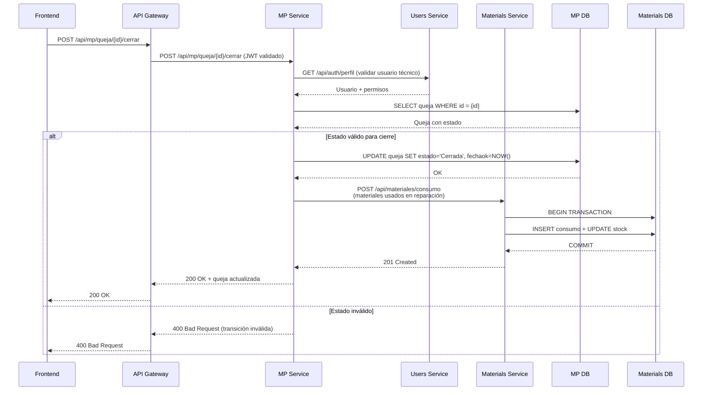
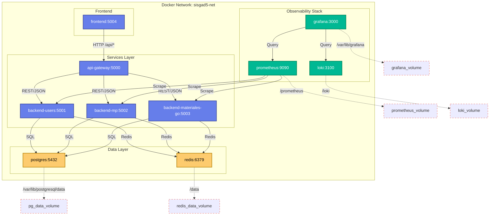

# 📐 ARCHITECTURE.md — Arquitectura Técnica de SISGAD5

> **Versión:** 1.1
> **Relacionado:** [SPEC.md](./SPEC.md), [Tesis 03 - Diseño](./docs/thesis/03_methodology.md)

---

## 1. Resumen Ejecutivo

SISGAD5 utiliza una **arquitectura de microservicios** con los siguientes principios:

- **4 contextos delimitados** (Auth, MP, Materials, Shared Kernel)
- **API Gateway** como única puerta de entrada
- **Bases de datos separadas** por servicio (PostgreSQL × 3)
- **Servicios stateless** (JWT, Redis para sesiones y caché)
- **Docker + Docker Compose** para orquestación
- **Comunicación via REST/JSON** entre todos los componentes

---

## 2. Componentes

| Componente            | Tecnología                                | Puerto | Responsabilidad                              |
| --------------------- | ----------------------------------------- | ------ | -------------------------------------------- |
| **Frontend**          | React 18 + Vite + TS + Tailwind           | 5004   | SPA responsiva                               |
| **API Gateway**       | Node.js + Express + http-proxy-middleware | 5000   | Enrutamiento, auth, rate limit, CORS         |
| **Users Service**     | Node.js + Express + Sequelize             | 5001   | Auth, usuarios, RBAC                         |
| **MP Service**        | Node.js + Express + Sequelize + Zod       | 5002   | Quejas, pruebas, trabajos, infraestructura   |
| **Materials Service** | Go + gorilla/mux + GORM                   | 5003   | Materiales, asignaciones, consumos (ACID)    |
| **PostgreSQL**        | PostgreSQL 17                             | 5432   | Persistencia (3 BDs)                         |
| **Redis**             | Redis 7                                   | 6379   | Caché, sesiones, locks distribuidos          |
| **Prometheus**        | Prometheus                                | 9090   | Métricas                                     |
| **Grafana**           | Grafana                                   | 3000   | Dashboards                                   |
| **Loki**              | Loki                                      | 3100   | Logging agregado                             |

---

## 3. Diagrama de Componentes

```mermaid
graph LR
    subgraph "Cliente"
        FE[Frontend<br/>React 18 + Vite]
    end

    subgraph "Edge"
        GW[API Gateway<br/>Node.js + Express]
    end

    subgraph "Servicios"
        US[Users Service<br/>Node.js + Sequelize]
        MPS[MP Service<br/>Node.js + Sequelize + Zod]
        MS[Materials Service<br/>Go + gorilla/mux + GORM]
    end

    subgraph "Datos"
        UBD[(Users DB<br/>bd_users)]
        MPDB[(MP DB<br/>bd_mp)]
        MADB[(Materials DB<br/>bd_materiales)]
        RDX[(Redis<br/>Cache/Sessions)]
    end

    %% Communication paths
    FE -- HTTPS | --> GW
    GW -- REST/JSON |/api/users/** --> US
    GW -- REST/JSON |/api/mp/** --> MPS
    GW -- REST/JSON |/api/materiales/** --> MS
    US -- SQL | --> UBD
    MPS -- SQL | --> MPDB
    MS -- SQL | --> MADB
    US -- Redis | --> RDX
    MPS -- Redis | --> RDX
    MS -- Redis | --> RDX

    %% Forbidden (visual cross)
    US -.->|❌ Prohibido| MPDB
    US -.->|❌ Prohibido| MADB
    MPS -.->|❌ Prohibido| UBD
    MPS -.->|❌ Prohibido| MADB
    MS -.->|❌ Prohibido| UBD
    MS -.->|❌ Prohibido| MPDB

    classDef service fill:#4a90d9,stroke:#2c5f8a,stroke-width:2px,color:#fff;
    classDef gateway fill:#ff9f43,stroke:#e67e22,stroke-width:2px,color:#fff;
    classDef frontend fill:#54a0ff,stroke:#2d5a9e,stroke-width:2px,color:#fff;
    classDef database fill:#5f27cd,stroke:#3a0d7a,stroke-width:2px,color:#fff;
    classDef cache fill:#00b893,stroke:#00875a,stroke-width:2px,color:#fff;
    classDef forbidden stroke-dasharray:5,5,stroke:#e74c3c;

    class FE,frontend
    class GW,gateway
    class US,MPS,MS,service
    class UBD,MPDB,MADB,database
    class RDX,cache
    class US-.->|❌ Prohibido| MPDB for,forbidden
```

---

## 4. Diagrama de Secuencia

### Flujo: Cierre de queja con consumo de materiales



---

## 5. Diagrama de Despliegue



---

## 6. Reglas de Comunicación

| Regla | Descripción |
|-------|-------------|
| **REST/JSON** | Todos los microservicios exponen APIs REST sobre HTTP con JSON como formato de intercambio. |
| **API Gateway como única entrada** | El frontend solo comunica con el Gateway en el puerto 5000. Nunca accede directamente a los microservicios. |
| **Sin acceso cruzado a BD** | Cada servicio accede únicamente a su propia base de datos. No hay consultas directas entre bases de datos. |
| **Autenticación centralizada** | El API Gateway valida el JWT en cada request. El login lo gestiona Users Service, que genera y firma el token. |
| **Referencias externas** | Cuando un servicio necesita datos de otro (ej. MP consulta datos de usuario), lo hace vía API REST, no acceso directo a BD. |
| **Autorización (RBAC)** | El Gateway verifica el rol del usuario (via JWT claims) y restringe endpoints. Cada servicio también valida permisos de forma redundante. |
| **Rate limiting** | El Gateway aplica rate limiting por IP y por usuario usando Redis como backend. |
| **Headers estandarizados** | `Authorization: Bearer <jwt>`, `Content-Type: application/json`, `X-Request-Id` para trazabilidad. |

---

## 7. Estrategia de Escalabilidad

### 7.1. Servicios Stateless

Todos los microservicios son **stateless**:
- No se almacena estado de sesión en memoria del proceso.
- Los tokens JWT son auto-contenidos (no requieren lookup en servidor).
- Redis se usa para: cacheo de consultas, locks distribuidos (Materials), y almacenamiento temporal de refresh tokens.

### 7.2. Réplicas Horizontales

- **Users Service, MP Service, Materials Service**: Se pueden escalar horizontalmente detrás del API Gateway (load balancing via Docker Compose o Kubernetes).
- **API Gateway**: Múltiples réplicas con sticky sessions opcionales (solo si se usa WebSocket; con JWT no es necesario).
- **Frontend**: Servido como archivos estáticos (puede ir a un CDN).

### 7.3. Caché con Redis

| Uso | Servicio | Estrategia |
|-----|----------|------------|
| Cache de queries | Todos | TTL de 300s, patrón cache-aside |
| Locks distribuidos | Materials | Redis `SET NX` con TTL para stock concurrente |
| Rate limiting | Gateway | Contador de requests por IP/user con ventana deslizante |
| Refresh tokens | Users | Almacenados en Redis con expiración (30 días) |

### 7.4. Optimización de Base de Datos

- Índices sobre columnas de búsqueda frecuente (num_reporte, id_telefono, fecha).
- Connection pooling (Sequelize pool: max=5; GORM: SetMaxOpenConns(100)).
- Read replicas para queries de reporte (futuro).

---

## 8. Decisiones Arquitectónicas (ADR)

### ADR-001: Arquitectura de Microservicios

| Campo | Valor |
|-------|-------|
| **Estado** | Aceptada |
| **Contexto** | El sistema debe gestionar teléfonos, líneas, pizarras, quejas, pruebas, trabajos y materiales con alta concurrencia en operaciones de materiales. |
| **Decisión** | Adoptar arquitectura de microservicios con 3 servicios principales + API Gateway. |
| **Consecuencias** | Mayor complejidad operacional, pero permite escalar y desarrollar equipos independientemente. Cada servicio tiene su propia BD. |

### ADR-002: Go para Materials Service

| Campo | Valor |
|-------|-------|
| **Estado** | Aceptada |
| **Contexto** | Las operaciones de materiales requieren transacciones ACID estrictas y concurrencia controlada (stock, bloqueo distribuido). |
| **Decisión** | Usar Go con GORM para el Materials Service. Go ofrece concurrencia eficiente (goroutines) y transacciones ACID nativas. |
| **Consecuencias** | Mayor rendimiento en operaciones críticas de stock. Mayor barrera de entrada para desarrolladores Node.js. |

### ADR-003: Bases de Datos Separadas (3 PostgreSQL)

| Campo | Valor |
|-------|-------|
| **Estado** | Aceptada |
| **Contexto** | Los datos de usuarios, operaciones MP y materiales tienen esquemas y requisitos de consistencia diferentes. |
| **Decisión** | Usar 3 bases de datos PostgreSQL separadas: `bd_users`, `bd_mp`, `bd_materiales`. |
| **Consecuencias** | Aislamiento total de datos. No hay acceso cruzado. Requiere sincronización asíncrona (eventos) para datos compartidos (ej: User.id referenciado). |

### ADR-004: API Gateway como Única Entrada

| Campo | Valor |
|-------|-------|
| **Estado** | Aceptada |
| **Contexto** | El frontend necesita una única URL de entrada y centralizar cross-cutting concerns. |
| **Decisión** | Colocar un API Gateway (Node.js + Express) como única puerta de entrada. |
| **Consecuencias** | Simplifica el frontend. Centraliza auth, rate limiting, CORS, logging. Cualquier cambio en routing afecta solo al Gateway. |

### ADR-005: JWT para Autenticación

| Campo | Valor |
|-------|-------|
| **Estado** | Aceptada |
| **Contexto** | Los servicios deben ser stateless y no depender de sesiones del servidor. |
| **Decisión** | Usar JWT (HS256) con expiración corta (15 min). Refresh tokens almacenados en Redis. |
| **Consecuencias** | Los tokens son auto-contenidos. El Gateway valida sin llamar al Users Service. Los refresh tokens permiten revocación. |

---

## 9. Arquitectura de Código (por microservicio)

### 9.1. Node.js Services (Users, MP)

```
backend-[service]/
├── src/
│   ├── config/          # Configuración y env vars
│   ├── controllers/     # Manejadores de rutas (presentation)
│   ├── middlewares/     # Auth, validation, error handling
│   ├── models/          # Sequelize models (domain entities)
│   ├── repositories/    # Data access (domain repositories)
│   ├── routes/          # Definición de endpoints
│   ├── services/        # Lógica de negocio (application)
│   ├── validators/      # Zod schemas
│   └── utils/           # Helpers
├── tests/
│   ├── unit/
│   └── integration/
├── migrations/
├── Dockerfile
└── docker-compose.yml
```

### 9.2. Go Service (Materials)

```
backend-materiales-go/
├── cmd/
│   └── api/
│       └── main.go      # Entry point
├── internal/
│   ├── config/          # Environment config
│   ├── handlers/        # HTTP handlers (presentation)
│   ├── logger/          # Structured logger
│   ├── models/          # GORM models (domain entities)
│   ├── repositories/
│   │   └── postgres/    # PostgreSQL implementations
│   ├── services/        # Business logic (application)
│   └── pkg/             # Shared utilities
├── migrations/
├── docs/                # Swagger (migrado a docs/api/)
├── Dockerfile
├── go.mod
└── go.sum
```

---

## 10. Principios de Diseño

1. **Single Responsibility**: Cada servicio gestiona un bounded context.
2. **Database per Service**: Ningún servicio accede directamente a la BD de otro.
3. **Stateless Services**: No se almacena estado de sesión en memoria.
4. **Async Communication**: Eventos vía RabbitMQ (futuro); actualmente sync REST.
5. **Health Checks**: Cada servicio expone `/health`.
6. **Centralized Logging**: Structured JSON logs (Pino/Zap/Winston).
7. **Observability**: Métricas Prometheus + dashboards Grafana.

---

## 11. Patrones Implementados

| Patrón | Dónde | Propósito |
|--------|-------|-----------|
| Repository | Todos | Abstracción de acceso a datos |
| Service Layer | Todos | Encapsular lógica de negocio |
| Factory | Domain | Validar invariantes en creación |
| Specification | MP (FSM) | Validar transiciones de estado |
| Strategy | MP (prioridad) | Cálculo configurable de prioridad |
| Lock Distribuido | Materials | Validación de stock concurrente |
| Circuit Breaker | Services | Resiliencia ante fallos externos |

---

## 12. Estrategia de Datos

### 12.1. Separación de Bases de Datos
- **bd_users**: Autenticación, usuarios, roles, sesiones
- **bd_mp**: Teléfonos, líneas, pizarras, quejas, pruebas, trabajos
- **bd_materiales**: Materiales, categorías, unidades, asignaciones, consumos

### 12.2. Compartición de Referencias
- `User.id` compartido como FK en MP y Materials (referencial integrity)
- No se comparten tablas completas
- Comunicación asíncrona (futuro RabbitMQ) para eventos de dominio

### 12.3. Migraciones
- **Node.js**: Sequelize migrations (`sequelize db:migrate`)
- **Go**: golang-migrate (`migrate -path migrations/ -database $DB_URL up`)

---

## 13. Seguridad

| Capa | Medida |
|------|--------|
| Transporte | HTTPS (TLS) en producción |
| Autenticación | JWT (HS256) con expiración corta |
| Autorización | RBAC por endpoint (middleware) |
| Validación | Zod (Node), custom validators (Go) |
| Rate Limiting | Redis-based (por IP y user) |
| Input Sanitización | express-validator, Helmet.js |
| Secrets | Variables de entorno (.env, gitignored) |

---

## 14. Referencias

- [SPEC.md - Arquitectura](./SPEC.md#3-arquitectura-del-sistema)
- [AGENT.md - Reglas Arquitectónicas](./AGENT.md)
- [Tesis 03 - Diseño](./docs/thesis/03_methodology.md)
- [Tesis 02 - Fundamentos](./docs/thesis/02_state_of_art.md)
- [UML Estático](./docs/practices/practice_05_uml_static.md)
