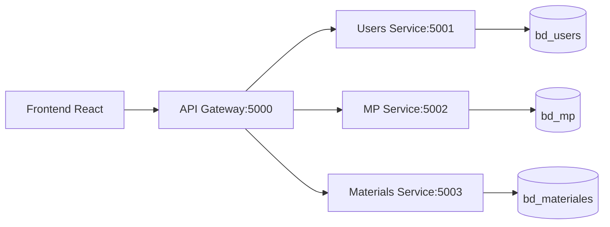

# Разработка информационно-консультативной системы с дашборд-представлением статистических данных по деятельности  телекоммуникационной компании.

> Система управления жалобами и услугами телекоммуникаций, разработанная в рамках магистерской диссертации по направлению «Индустриальное программирование».

[Полная документация](./docs/) • [API Reference](./docs/API_REFERENCE.md) • [Health Checks](#-health-checks)

> 🇪🇸 [Versión en español](README.md) | 🇷🇺 Версия на русском языке

---

---
## Разработка системы управления жалобами и материалами для телекоммуникационной компании на основе микросервисной архитектуры.

### 1. Основание для разработки
Разработка системы SISGAD5 обусловлена необходимостью цифровизации процессов управления операционной деятельностью на предприятии телекоммуникаций в Кубе, а также требованиями магистерской диссертации по направлению «Индустриальное программирование» в Университете РТУ МИРЭА (Россия). Система направлена на оптимизацию операционного управления, сокращение времени реагирования на инциденты абонентов и улучшение процесса принятия решений руководством и специалистами предприятия.

### 2. Назначение разработки
Разработка информационной системы и консультационной поддержки с представлением на dashboard статистических данных о деятельности предприятия телекоммуникаций.

Создание масштабируемой системы на базе микросервисов для управления информацией о телекоммуникационных услугах и процессе reports об их повреждениях, от первоначального звонка до окончательного решения. А также управление информацией о тестах, работах и материалах, используемых в решениях; и генерация аналитических и предиктивных отчетов с целью улучшения процесса принятия решений на предприятии.

### 3. Цели разработки
- Реализовать независимые микросервисы с четкими границами ответственности
- Гарантировать высокую доступность и отказоустойчивость системы
- Интегрироваться с существующей инфраструктурой предприятия
- Гарантировать безопасность информации в системе
- Заложить основы для внедрения предиктивной аналитики

### 4. Требования к функциональным характеристикам

#### 4.1. Модуль аутентификации и авторизации
- Регистрация и аутентификация пользователей через JWT.
- Ролевая модель доступа (RBAC): `admin`, `probador`, `editor`, `visor`, `admin_materiales`.
- Механизм refresh tokens для продления сессий.

#### 4.2. Модуль управления жалобами (MP Service)
- CRUD операции для услуг (телефоны, телефонные линии, учрежденческие АТС).
- CRUD операции для жалоб, тестов и работ.
- Модель состояний: `Abierta` → `Probada` → `Asignada` → `Pendiente` → `Resuelta` → `Cerrada`
- История изменений и аудитория действий.

#### 4.3. Модуль управления материалами (Materials Service - Go)
- Транзакционное списание материалов при выполнении работ.
- Валидация доступности перед назначением задачи.
- Проверка наличия материалов у работников для быстрого назначения.
- Конкурентная обработка через goroutines.

#### 4.4. Модуль аналитики и отчетов
- Агрегированные метрики: время ответа, % закрытых жалоб, потребление материалов.
- Экспорт данных в форматах CSV/JSON.
- Визуализация с помощью дашбордов.
- Отображение предупреждений и предсказаний.

#### 4.5. API Gateway
- Единая точка входа для всех клиентских запросов.
- Маршрутизация запросов к соответствующим микросервисам.
- Health-checks для мониторинга состояния сервисов.

### 5. Требования к надежности
- Гарантия целостности данных в транзакциях между сервисами.
- Механизм повторных попыток (retry) при временных сбоях сети.
- Структурированное регистрирование событий для отладки и аудита.
- Резервное копирование базы данных PostgreSQL по расписанию.

### 6. Условия эксплуатации
- Веб-доступ через современные браузеры (Chrome, Firefox, Edge).
- Поддержка мобильных устройств с адаптивным интерфейсом.
- Работа только в корпоративной сети.
- Локальное развертывание на серверах предприятия на Кубе.

### 7. Требования к составу и параметрам технических средств
- **Сервер приложения**: 4 ядра, 8 ГБ ОЗУ, 50 ГБ SSD.
- **СУБД**: PostgreSQL 17+ с репликацией.
- **Контейнеризация**: Docker 24+, Docker Compose.
- **Сеть**: 100 Мбит/с внутри центра данных, кэширование статики.

### 8. Требования к информационной и программной совместимости
- REST API с форматом JSON и спецификацией OpenAPI 3.0.
- Поддержка CORS для интеграции с внешними системами.
- Совместимость с LDAP/Active Directory для корпоративной аутентификации.
- Экспорт данных в форматах, совместимых с SAP ERP и GLPI.

### 9. Этапы разработки
1. Проектирование архитектуры и контрактов API.
2. Реализация базовых сервисов (Auth, Users, Gateway).
3. Разработка бизнес-логики (MP, Materials).
4. Интеграция с frontend и тестирование.
5. Оптимизация производительности и безопасности.
6. Документирование и подготовка к защите диссертации.

### 10. Порядок контроля и приемки
- Модульное тестирование критических путей (Jest, Go testing).
- Интеграционное тестирование через Postman/Insomnia.
- Нагрузочное тестирование ключевых endpoints (k6).
- Аудит безопасности: зависимости, инъекции, XSS.
- Приемочные испытания с участием клиента.

---

# ОПИСАНИЕ ПРОГРАММЫ
## «SISGAD5: Система информации для управления и поддержки Directorate No. 5»

### 1. Общие сведения

#### 1.1. Обозначение и наименование программы
- **Обозначение**: SISGAD5/v1.0
- **Наименование**: Информационная система для управления и поддержки дирекции № 5.
- **Краткое наименование**: SISGAD5

#### 1.2. Программное обеспечение, необходимое для функционирования
- **Runtime**: Node.js 22.x, Go 1.25+
- **СУБД**: PostgreSQL 17+ с расширениями:
  - `pg_stat_statements` для мониторинга запросов.
  - `uuid-ossp` для генерации идентификаторов.
- **Контейнеризация**: Docker Engine 24+, Docker Compose v2.
- **Веб-клиент**: Браузер с поддержкой ES2022, WebAssembly (опционально).

#### 1.3. Языки программирования и технологии
| Компонент         | Технологии                                | Назначение                         |
| ----------------- | ----------------------------------------- | ---------------------------------- |
| API Gateway       | Node.js + Express + http-proxy-middleware | Маршрутизация, auth, rate-limit    |
| Users Service     | Node.js + Express + Sequelize + bcrypt    | Управление пользователями и ролями |
| MP Service        | Node.js + Express + Sequelize + Zod       | Бизнес-логика жалоб и работ        |
| Materials Service | Go + Gin + GORM                           | Управление инвентарем и транзакции |
| Frontend          | React 18 + Vite + TypeScript + Tailwind   | Пользовательский интерфейс         |
| Инфраструктура    | Docker + PostgreSQL + Redis               | Оркестрация и хранение данных      |

### 2. Функциональное назначение

#### 2.1. Класс решаемых задач
Система предназначена для автоматизации информации об операционных процессах предприятия телекоммуникаций:
- Централизованная регистрация и классификация жалоб абонентов.
- Координация работ по ремонту между группами и департаментами.
- Контроль потребления материалов и предотвращение дефицита.
- Генерация отчетов для принятия управленческих решений.

#### 2.2. Назначение программы
SISGAD5 гарантирует целостный цифровой процесс от регистрации жалобы до её закрытия, с интеграцией модуля управления материалами для оптимизации логистики и снижения операционных затрат.

#### 2.3. Функциональные ограничения
- Система работает в онлайн-режиме; офлайн-режим не поддерживается.
- Модуль предиктивной аналитики является прототипом и требует дополнительной разработки.
- Интеграция с внешними системами (SAP, GLPI) реализуется через адаптеры.

### 3. Описание логической структуры

#### 3.1. Алгоритм работы программы

**Типичный сценарий «Закрытие жалобы с потреблением материалов»**:

1. Пробадор создает жалобу → состояние `Abierta` (Открытая).
2. Реализуется тест и сохраняются его данные → состояние `Probada` (Попробованная).
3. Назначается оператор для ремонта повреждения → состояние `Asignada` (Назначенная).
4. Вводятся данные об успешном ремонте → состояние `Resuelta` (Устраненная).
5. Пробадор закрывает жалобу → состояние `Cerrada`(закрытая).
6. Администратор материалов регистрирует материалы, использованные в полевой работе.

#### 3.2. Используемые методы
- **Архитектурные**: Микросервисы, API Gateway, CQRS (для аналитики).
- **Безопасность**: JWT + Refresh Tokens, RBAC, Helmet.js, валидация ввода (Zod).
- **Конкурентность**: Async/Await (Node.js), Goroutines + Channels (Go).
- **Данные**: Sequelize ORM (Node), GORM (Go), миграции через CLI.
- **Логирование**: Winston/Pino с ротацией файлов + структурированный JSON.

#### 3.3. Структура программы

##### 3.3.1. Основные модули:

| #   | Модуль         | Сервис                                          | Описание                                                                              |
| --- | -------------- | ----------------------------------------------- | ------------------------------------------------------------------------------------- |
| 1   | **Телефоны**   | MP Service                                      | Управление телефонами, назначенными абонентам, номерами, состояниями и расположением. |
| 2   | **Линии**      | MP Service                                      | Администрирование линий и цепей телекоммуникаций, трассировка.                        |
| 3   | **Пизаррас**   | MP Service                                      | Контроль распределительных пизаррас, портов и физических соединений.                  |
| 4   | **Жалобы**     | MP Service                                      | Регистрация, классификация и мониторинг инцидентов абонентов.                         |
| 5   | **Тесты**      | MP Service                                      | Выполнение диагностических тестов для проверки reported неисправностей.               |
| 6   | **Работы**     | MP Service                                      | Назначение и выполнение работ по ремонту и обслуживанию.                              |
| 7   | **Материалы**  | Materials Service (Go)                          | Инвентарь, поставки, назначение материалов на работы.                                 |
| 8   | **Статистика** | MP Service + Analytics + Materials Service (Go) | Метрики, KPI, отчеты и dashboard производительности системы.                          |

**Детали каждого модуля**:

1. **Телефоны**: CRUD телефонов, связь с абонентами, история назначений, состояние (активен/неактивен/поврежден).

2. **Линии**: Регистрация физических и логических линий, трассировка маршрута, операционный статус, профилактическое обслуживание.

3. **Пизаррас**: Инвентарь распределительных пизаррас, маппинг портов, входящие/исходящие соединения, физическое расположение.

4. **Жалобы**: Регистрация инцидентов, классификация по типу/услуге/расположению, приоритизация, назначение технику.

5. **Тесты**: Протоколы тестирования, результаты, доказательства (фото/измерения), связь с жалобами и работами.

6. **Работы**: Заказы на работы, назначение техников, требуемые материалы, расчетное/фактическое время, закрытие.

7. **Материалы**: Инвентарь в реальном времени, приход/расход, предупреждения о минимальном запасе, расход по работе/технику.

8. **Статистика**: Интерактивные dashboard, KPI производительности, тренды, экспорт отчетов.

##### 3.3.2. Архитектура Микросервисов

### 3.4. Связи с другими программами

- Интеграция с LDAP/Active Directory через middleware аутентификации
- Экспорт отчетов в CSV для импорта в SAP ERP
- Уведомления webhook для систем мониторинга (Nagios, GLPI)
- Интеграция с веб-почтовым сервером для отправки уведомлений сотрудникам

## 4. Используемые технические средства

### 4.1. Аппаратные требования

| Параметр              | Минимальные     | Рекомендуемые   |
| --------------------- | --------------- | --------------- |
| Процессор             | 2 ядра, 2.5 ГГц | 4 ядра, 3.5 ГГц |
| ОЗУ                   | 4 ГБ            | 8 ГБ            |
| Дисковое пространство | 20 ГБ (SSD)     | 50 ГБ (NVMe)    |
| Сеть                  | 10 Мбит/с       | 100 Мбит/с      |

### 4.2. Программные платформы

- **ОС**: Ubuntu 22.04 LTS / Windows Server 2022.
- **Контейнеризация**: Docker Engine 24.0+, Compose v2.20+
- **СУБД**: PostgreSQL 17.0+ с конфигурацией `shared_buffers = 256MB`

## 5. Вызов и загрузка

### 5.1. Способ вызова программы

Система вызывается через веб-браузер по URL-адресу:

**`http://[адрес_сервера]:5004/`**

### 5.2. Входные точки

| Endpoint                     | Метод    | Описание                           |
| ---------------------------- | -------- | ---------------------------------- |
| `/api/auth/login`            | POST     | Аутентификация пользователей       |
| `/api/mp/queja`              | GET/POST | Управление заявками абонентов      |
| `/api/mp/prueba`             | GET/POST | Управление станционными проверками |
| `/api/mp/trabajo`            | GET/POST | Управление ремонтными работами     |
| `/api/materiales/inventario` | GET      | Запрос инвентаря материалов        |
| `/api/materiales/entrega`    | POST     | Регистрация выдачи материалов      |
| `/api/estadisticas/resumen`  | GET      | Dashboard метрик                   |
| `/health`                    | GET      | Проверка состояния системы         |

### 5.3. Требования к памяти

- **ОЗУ**: 256 МБ на процесс Node.js, 128 МБ на сервис Go
- **Дисковое пространство для БД**: 100 МБ на 10 000 записей
- **Временные файлы сессий**: до 1 МБ на активного пользователя

## 6. Входные данные

### 6.1. Характер и организация входных данных

- **Данные пользователя**:
  - Учетные данные для доступа (электронная почта, пароль)
  - Назначенные роли и разрешения
  - Языковые предпочтения (es/ru)

- **Бизнес-данные**:
  - Информация о заявках абонентов (описание, затронутая услуга, расположение)
  - Информация о телекоммуникационных услугах (телефоны, телефонные линии, учрежденческие АТС)
  - Запрошенные материалы (код, количество, связанная работа)
  - Статусы и переходы рабочего потока

- **Конфигурационные данные**:
  - Параметры подключения к СУБД
  - Ключи JWT и секреты окружения
  - Конфигурация rate-limiting

### 6.2. Формат и способ кодирования

- **Данные форм**: UTF-8, валидация на сервере (Zod).
- **Токены сессии**: JWT, кодированные в Base64.
- **Данные БД**: JSON для сложных структур, нативные типы PostgreSQL.
- **Логи**: текстовый формат с временными метками ISO 8601.

## 7. Выходные данные

### 7.1. Характер и организация выходных данных

- **Статистические отчеты**:
  - Общее количество заявок за период.
  - Среднее время восстановления услуги.
  - Материалы, потребленные по сотруднику.
  - Процент закрытых заявок.
  - Статус ресурсов (телефоны, телефонные линии, учрежденческие АТС).

- **Уведомления**:
  - Предупреждения о низком запасе материалов.
  - Напоминания о ожидающих рассмотрения заявках.
  - Подтверждения выполненных операций.

- **Технические данные**:
  - Логи доступа и операций.
  - Метрики производительности (время ответа, время безотказной работы).
  - Резервные копии конфигурации.

### 7.2. Формат и способ представления

- **Веб-интерфейс**: HTML5 со стилизацией CSS3 (Tailwind).
- **Графики**: Recharts/Chart.js с данными в реальном времени.
- **Таблицы**: адаптивная HTML-разметка с пагинацией.
- **Экспорт**: CSV, JSON, PDF (через библиотеки фронтенда).

## Лицензирование

Лицензирование программного продукта не требуется.