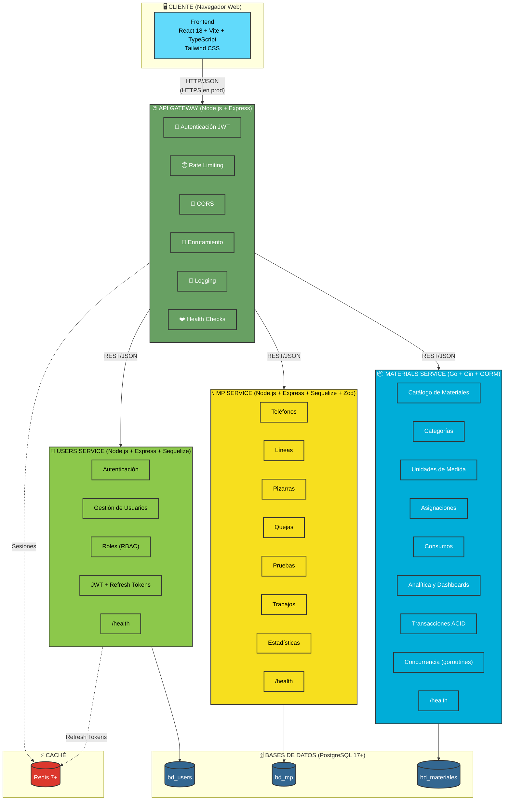

Perfecto. A continuación te presento el archivo **`SPEC.md`** (Especificación Técnica del Proyecto SISGAD5). Este documento consolida la especificación funcional, técnica y arquitectónica del sistema, sirviendo como referencia única para desarrolladores, agentes de IA y para la defensa de la tesis.

Está diseñado para colocarse en la raíz del repositorio (`SISGAD5_1.0/SPEC.md`).

---

```markdown
# 📐 SPEC.md — Especificación Técnica del Proyecto SISGAD5

> **Versión:** 1.0
> **Proyecto:** SISGAD5 — Sistema de Información para la Gestión y Soporte de la Dirección No. 5
> **Repositorio:** https://github.com/ybotet/SISGAD5_1.0
> **Autor:** Ing. Botet S.Y. (Tesis de Maestría — RTU MIREA)
> **Fecha:** 2026-09-24
> **Estado:** En desarrollo activo
> **Licencia:** Uso académico

---

## 📑 Tabla de Contenidos

1. [Visión General](#1-visión-general)
2. [Objetivos y Alcance](#2-objetivos-y-alcance)
3. [Arquitectura del Sistema](#3-arquitectura-del-sistema)
4. [Stack Tecnológico](#4-stack-tecnológico)
5. [Modelo de Datos](#5-modelo-de-datos)
6. [Especificación de Módulos](#6-especificación-de-módulos)
7. [Contratos de API](#7-contratos-de-api)
8. [Seguridad](#8-seguridad)
9. [Requisitos No Funcionales](#9-requisitos-no-funcionales)
10. [Despliegue y Operación](#10-despliegue-y-operación)
11. [Testing y Calidad](#11-testing-y-calidad)
12. [Roadmap y Evolución](#12-roadmap-y-evolución)
13. [Glosario](#13-glosario)
14. [Referencias](#14-referencias)

---

## 1. Visión General

### 1.1. Descripción

**SISGAD5** (Sistema de Información para la Gestión y Soporte de la Dirección No. 5) es una plataforma de microservicios diseñada para digitalizar y optimizar los procesos operativos de la Dirección No. 5 (DAG5) de la empresa de telecomunicaciones de Cuba (ETECSA).

El sistema reemplaza el sistema heredado **"Mesa de Quejas"** (Microsoft Access, año 2000), que presenta limitaciones críticas de escalabilidad, trazabilidad, concurrencia y seguridad.

### 1.2. Contexto del Proyecto

- **Cliente:** Dirección No. 5 (DAG5) — ETECSA, Cuba
- **Contexto académico:** Tesis de Maestría en "Ingeniería Industrial" — RTU MIREA, Moscú
- **Autor:** Ing. Botet S.Y.
- **Duración:** 2025–2026
- **Estado:** En desarrollo activo (fase de "puerto seguro")

### 1.3. Problema que Resuelve

| Problema Actual | Solución SISGAD5 |
|---|---|
| Sistema monolítico en Access, obsoleto | Arquitectura de microservicios moderna |
| Sin trazabilidad ni auditoría | Historial completo + logs estructurados |
| Sin control de acceso por roles | RBAC + JWT |
| Concurrencia insegura | Transacciones ACID + bloqueo a nivel de fila |
| Sin integración con sistemas externos | API REST + exportación a SAP |
| Sin analítica en tiempo real | Dashboards + métricas agregadas |
| Gestión de materiales manual | Microservicio dedicado con validación transaccional |

---

## 2. Objetivos y Alcance

### 2.1. Objetivo General

Desarrollar una plataforma de microservicios que automatice la gestión operativa de la DAG5, cubriendo el ciclo completo desde la recepción de una queja hasta su resolución, incluyendo la gestión de materiales utilizados en los trabajos de reparación.

### 2.2. Objetivos Específicos

1. Implementar microservicios independientes con responsabilidades bien definidas.
2. Garantizar la integridad transaccional (ACID) en operaciones críticas.
3. Proporcionar una interfaz de usuario moderna y responsive.
4. Ofrecer dashboards analíticos con KPIs operativos.
5. Asegurar la trazabilidad completa de todas las operaciones.
6. Preparar la base para analítica predictiva (tesis de maestría).

### 2.3. Alcance

#### ✅ Incluido en el Alcance
- Gestión de usuarios, roles y autenticación (JWT + RBAC)
- Gestión de teléfonos, líneas y pizarras
- Gestión de quejas, pruebas y trabajos
- Gestión de materiales (asignaciones y consumos)
- Dashboards analíticos
- API Gateway centralizado
- Despliegue con Docker Compose

#### ❌ Fuera del Alcance (Actual)
- Integración LDAP/Active Directory
- Integración con SAP ERP
- Analítica predictiva con ML
- Aplicación móvil nativa
- Migración a Kubernetes
- Colas de mensajes (RabbitMQ/Kafka)

---

## 3. Arquitectura del Sistema

### 3.1. Estilo Arquitectónico

**Microservicios** con las siguientes características:

- **Descentralización de datos:** Cada microservicio es dueño exclusivo de su BD.
- **Comunicación vía REST/JSON:** No hay llamadas directas entre servicios.
- **API Gateway como única puerta de entrada.**
- **Stateless:** Los servicios no guardan estado de sesión (JWT).
- **Contenerización:** Docker + Docker Compose.

### 3.2. Diagrama de Componentes



### 3.3. Reglas Arquitectónicas

| # | Regla | Justificación |
|---|---|---|
| R1 | El frontend solo se comunica con el API Gateway | Seguridad y punto único de entrada |
| R2 | Cada microservicio tiene su propia BD | Desacoplamiento y escalabilidad independiente |
| R3 | No hay acceso directo a BD de otro servicio | Integridad y autonomía |
| R4 | La autenticación se centraliza en el Gateway | Consistencia y seguridad |
| R5 | El MP Service NO gestiona materiales | Separación de responsabilidades |
| R6 | Materials Service usa transacciones ACID | Integridad de inventario |
| R7 | Comunicación vía REST/JSON | Simplicidad e interoperabilidad |
| R8 | Servicios stateless | Escalabilidad horizontal |

---

## 4. Stack Tecnológico

### 4.1. Backend

| Componente | Tecnología | Versión | Justificación |
|---|---|---|---|
| API Gateway | Node.js + Express + http-proxy-middleware | 22.x | Madurez, ecosistema |
| Users Service | Node.js + Express + Sequelize | 22.x | CRUD rápido |
| MP Service | Node.js + Express + Sequelize + Zod | 22.x | Validación de esquemas |
| Materials Service | Go + Gin + GORM | 1.25+ | Concurrencia nativa, ACID, rendimiento |

### 4.2. Frontend

| Componente | Tecnología | Versión |
|---|---|---|
| Framework | React | 18 |
| Build Tool | Vite | 5+ |
| Lenguaje | TypeScript | 5+ |
| Estilos | Tailwind CSS | 3+ |
| HTTP Client | Axios | 1+ |
| Estado | Context API / Zustand | — |
| Gráficos | Recharts / Chart.js | — |

### 4.3. Bases de Datos

| BD | Motor | Versión | Dueño |
|---|---|---|---|
| bd_users | PostgreSQL | 17+ | Users Service |
| bd_mp | PostgreSQL | 17+ | MP Service |
| bd_materiales | PostgreSQL | 17+ | Materials Service |

**Extensiones PostgreSQL requeridas:**
- `pg_stat_statements` — Monitoreo de consultas
- `uuid-ossp` — Generación de UUIDs

### 4.4. Infraestructura

| Componente | Tecnología | Versión |
|---|---|---|
| Contenerización | Docker | 24+ |
| Orquestación (dev/prod) | Docker Compose | v2.20+ |
| Caché | Redis | 7+ |
| CI/CD | GitHub Actions | — |
| Monitoreo | Prometheus + Grafana | — |

---

## 5. Modelo de Datos

### 5.1. Base de Datos: `bd_users`

**Entidades principales:**

| Tabla | Descripción |
|---|---|
| `usuarios` | Usuarios del sistema (email, password hash, nombre) |
| `roles` | Roles disponibles (admin, probador, editor, visor, admin_materiales) |
| `usuario_rol` | Relación N:M entre usuarios y roles |
| `refresh_tokens` | Tokens de refresco para sesiones prolongadas |
| `sesiones` | Historial de sesiones (opcional) |

### 5.2. Base de Datos: `bd_mp`

**Entidades principales:**

| Tabla | Descripción |
|---|---|
| `telefonos` | Teléfonos con datos del cliente incluidos |
| `lineas` | Líneas telefónicas |
| `pizarras` | Pizarras de distribución |
| `quejas` | Quejas de abonados |
| `pruebas` | Pruebas técnicas realizadas |
| `trabajos` | Órdenes de trabajo |
| `historial_*` | Historial de cada entidad |

**Estados definidos:**

| Entidad | Estados |
|---|---|
| Teléfono | `activo`, `baja` |
| Línea | `activo`, `baja` |
| Queja | `Abierta` → `Probada` → `Asignada` → `Pendiente` → `Resuelta` → `Cerrada` |

### 5.3. Base de Datos: `bd_materiales`

**Entidades principales:**

| Tabla | Descripción |
|---|---|
| `tb_categorias` | Categorías de materiales |
| `tb_unidades_medida` | Unidades de medida |
| `tb_materiales` | Catálogo de materiales (sin campo "stock" físico) |
| `tb_asignaciones` | Cabeceras de asignaciones a trabajadores |
| `tb_asignacion_detalle` | Detalles de asignaciones (con `costo_unitario_momento`) |
| `tb_consumos` | Cabeceras de consumos reales |
| `tb_consumo_detalle` | Detalles de consumos (con `costo_unitario_real`) |

**Características clave:**
- **Sin campo `stock` físico:** Delegado a SAP.
- **Saldo lógico por trabajador:** Calculado dinámicamente = Σ(asignado) − Σ(consumido).
- **Trazabilidad financiera:** Precios congelados en momento de operación.
- **Integridad referencial:** Foreign Keys en todas las relaciones.

---

## 6. Especificación de Módulos

### 6.1. Módulo 1 — Users Service

**Responsabilidad:** Autenticación, autorización y gestión de usuarios.

**Funcionalidades:**
- Registro de usuarios
- Login con JWT
- Refresh tokens
- Logout
- CRUD de usuarios (admin)
- Gestión de roles (RBAC)
- Endpoint `/health`

**Roles del sistema:**
| Rol | Permisos |
|---|---|
| `admin` | Acceso total |
| `probador` | Crear/ver quejas y pruebas |
| `editor` | Editar quejas, pruebas, trabajos |
| `visor` | Solo lectura |
| `admin_materiales` | Gestión completa de materiales |

### 6.2. Módulo 2 — MP Service

**Responsabilidad:** Operaciones principales (quejas, pruebas, trabajos, infraestructura).

**Submódulos:**

#### 6.2.1. Gestión de Teléfonos
- CRUD de teléfonos (con datos del cliente incluidos)
- Estados: `activo` / `baja`
- Historial completo: quejas, recorridos, movimientos
- Búsqueda y filtrado

#### 6.2.2. Gestión de Líneas
- CRUD de líneas
- Estados: `activo` / `baja`
- Historial completo: quejas, recorridos, movimientos
- Búsqueda y filtrado

#### 6.2.3. Gestión de Pizarras
- CRUD de pizarras
- Mapeo de puertos
- Conexiones entrantes/salientes
- Ubicación física
- Búsqueda y filtrado
- Historial completo

#### 6.2.4. Gestión de Quejas
- Registro, clasificación y priorización
- Flujo de estados completo
- Asignación de técnico
- Historial y auditoría
- Búsqueda, filtrado y paginación

#### 6.2.5. Gestión de Pruebas
- Registro de pruebas
- Resultados
- Vinculación con queja y trabajo
- Historial

#### 6.2.6. Gestión de Trabajos
- Creación de órdenes de trabajo
- Asignación de técnico
- Tiempo estimado vs real
- Cierre de trabajo
- Historial

> ⚠️ **Nota:** El MP Service **NO** gestiona materiales. Solo referencia IDs. La lógica de materiales vive exclusivamente en Materials Service.

#### 6.2.7. Estadísticas (MP)
- Endpoint de resumen
- Métricas agregadas
- Filtros por fecha/servicio

### 6.3. Módulo 3 — Materials Service

**Responsabilidad:** Gestión transaccional de materiales.

**Submódulos:**

#### 6.3.1. Catálogo de Materiales
- CRUD de materiales
- Validación de campos obligatorios
- Paginación
- Búsqueda textual
- Filtros por categoría/unidad

#### 6.3.2. Categorías y Unidades
- CRUD de categorías
- CRUD de unidades de medida
- Integridad referencial

#### 6.3.3. Asignación de Materiales
- Crear asignación con múltiples ítems
- Captura de precio en momento de asignación
- **Transacción ACID**
- Validación de existencia de material
- Validación de stock (stub → a completar)
- Concurrencia con goroutines
- Historial

#### 6.3.4. Registro de Consumos
- Crear consumo con múltiples ítems
- Captura de precio real
- **Transacción ACID**
- Validación de cantidades
- Validación contra asignación
- Concurrencia con goroutines
- Historial

#### 6.3.5. Analítica y Dashboards
- Endpoint de resumen general
- Distribución por categorías
- Distribución por unidades
- Cálculo de saldo lógico por trabajador
- Alertas de stock bajo (planificado)
- Exportación CSV/JSON (planificado)
- Tendencias y predicciones (planificado — tesis)

#### 6.3.6. Integración
- Endpoints REST bajo `/api/materials/*`
- Compatibilidad con API Gateway
- Health check `/health`
- Documentación Swagger
- Exportación a SAP (planificado)

### 6.4. Módulo 4 — Frontend

**Responsabilidad:** Interfaz de usuario.

**Funcionalidades:**
- Login y gestión de sesión
- Dashboard principal
- Módulos: teléfonos, líneas, pizarras, quejas, pruebas, trabajos, materiales, estadísticas
- Gestión de usuarios
- Perfil de usuario
- Internacionalización (ES/RU)
- Responsive design
- Manejo de errores y loading states
- Notificaciones toast

### 6.5. Módulo 5 — API Gateway

**Responsabilidad:** Punto único de entrada.

**Funcionalidades:**
- Enrutamiento a los 3 servicios
- Verificación de JWT
- Rate limiting
- CORS
- Logging centralizado
- Health checks agregados
- Manejo de errores unificado

### 6.6. Módulo 6 — Analítica (Transversal)

**Responsabilidad:** KPIs y reportes.

**Funcionalidades:**
- Dashboard de KPIs
- Tiempo promedio de resolución
- Porcentaje de quejas cerradas
- Consumo de materiales por técnico/trabajo
- Exportación de reportes (CSV/JSON/PDF)
- Analítica predictiva (planificado)

---

## 7. Contratos de API

### 7.1. Convenciones Generales

- **Protocolo:** HTTP/HTTPS
- **Formato:** JSON (UTF-8)
- **Autenticación:** Bearer JWT en header `Authorization`
- **Versionado:** Prefijo `/api/` (futuro: `/api/v1/`)
- **Códigos HTTP:**
  - `200 OK` — Éxito
  - `201 Created` — Recurso creado
  - `400 Bad Request` — Error de validación
  - `401 Unauthorized` — No autenticado
  - `403 Forbidden` — Sin permisos
  - `404 Not Found` — No encontrado
  - `409 Conflict` — Conflicto
  - `500 Internal Server Error` — Error del servidor

### 7.2. Endpoints Principales

| Endpoint | Método | Servicio | Descripción |
|---|---|---|---|
| `/api/auth/login` | POST | Users | Login |
| `/api/auth/refresh` | POST | Users | Refrescar token |
| `/api/auth/logout` | POST | Users | Logout |
| `/api/users/*` | CRUD | Users | Gestión de usuarios |
| `/api/mp/telefonos/*` | CRUD | MP | Teléfonos |
| `/api/mp/lineas/*` | CRUD | MP | Líneas |
| `/api/mp/pizarras/*` | CRUD | MP | Pizarras |
| `/api/mp/quejas/*` | CRUD | MP | Quejas |
| `/api/mp/pruebas/*` | CRUD | MP | Pruebas |
| `/api/mp/trabajos/*` | CRUD | MP | Trabajos |
| `/api/materials/materiales/*` | CRUD | Materials | Materiales |
| `/api/materials/categorias/*` | CRUD | Materials | Categorías |
| `/api/materials/unidades/*` | CRUD | Materials | Unidades |
| `/api/materials/asignaciones/*` | CRUD | Materials | Asignaciones |
| `/api/materials/consumos/*` | CRUD | Materials | Consumos |
| `/api/materials/dashboard/*` | GET | Materials | Analítica |
| `/health` | GET | Todos | Health check |

### 7.3. Ejemplo de Contrato (Materials — Crear Asignación)

**Request:**
```http
POST /api/materials/asignaciones
Authorization: Bearer <JWT>
Content-Type: application/json

{
  "id_trabajador": 123,
  "fecha_asignacion": "2026-09-24T10:00:00Z",
  "observaciones": "Materiales para instalación de fibra óptica",
  "detalles": [
    { "id_material": 11, "cantidad": 2 },
    { "id_material": 12, "cantidad": 5 }
  ]
}
```

**Response (201 Created):**
```json
{
  "id": 3,
  "id_trabajador": 123,
  "fecha_asignacion": "2026-09-24T10:00:00Z",
  "observaciones": "Materiales para instalación de fibra óptica",
  "created_at": "2026-09-24T10:00:00Z",
  "detalles": [
    {
      "id": 4,
      "id_asignacion": 3,
      "id_material": 11,
      "cantidad": 2,
      "costo_unitario": 0.83
    },
    {
      "id": 5,
      "id_asignacion": 3,
      "id_material": 12,
      "cantidad": 5,
      "costo_unitario": 50
    }
  ]
}
```

---

## 8. Seguridad

### 8.1. Autenticación

- **JWT** firmado con HS256 (o RS256 en producción).
- **Access token:** Corta duración (15 min).
- **Refresh token:** Larga duración (7 días), almacenado en BD.
- **Almacenamiento en frontend:** `httpOnly cookies` (recomendado) o `localStorage` (a evaluar).

### 8.2. Autorización

- **RBAC** (Role-Based Access Control).
- Roles: `admin`, `probador`, `editor`, `visor`, `admin_materiales`.
- Middleware de autorización en el API Gateway.

### 8.3. Protecciones

| Amenaza | Mitigación |
|---|---|
| Fuerza bruta | Rate limiting + bloqueo por intentos fallidos |
| Inyección SQL | ORM (Sequelize/GORM) + consultas parametrizadas |
| XSS | Sanitización + Content Security Policy |
| CSRF | Tokens CSRF + SameSite cookies |
| Inyección de dependencias | `npm audit` + Dependabot |
| Exposición de secretos | Variables de entorno + `.gitignore` |
| Headers inseguros | Helmet.js |

### 8.4. Auditoría

- Logs estructurados (JSON) con timestamp ISO 8601.
- Registro de: quién, qué, cuándo, dónde.
- Rotación de logs.
- **No** registrar datos sensibles (passwords, tokens).

---

## 9. Requisitos No Funcionales

| ID | Categoría | Requisito | Métrica |
|---|---|---|---|
| RNF-01 | Rendimiento | Tiempo de respuesta en lecturas | < 300 ms (p95) |
| RNF-02 | Rendimiento | Tiempo de respuesta en transacciones | < 800 ms (p95) |
| RNF-03 | Disponibilidad | Uptime en horario laboral | 99.5% (8:00–18:00, L–V) |
| RNF-04 | Concurrencia | Usuarios simultáneos | ≥ 20 sin degradación |
| RNF-05 | Integridad | Transacciones ACID | 100% en operaciones críticas |
| RNF-06 | Seguridad | Validación de entrada | 100% de endpoints |
| RNF-07 | Escalabilidad | Arquitectura stateless | Réplicas horizontales |
| RNF-08 | Mantenibilidad | Cobertura de tests | ≥ 70% |
| RNF-09 | Usabilidad | Responsive design | Móvil, tablet, desktop |
| RNF-10 | Internacionalización | Idiomas soportados | ES, RU |
| RNF-11 | Observabilidad | Health checks | Todos los servicios |
| RNF-12 | Recuperación | RTO / RPO | < 1 h / < 15 min |

---

## 10. Despliegue y Operación

### 10.1. Requisitos de Hardware

| Recurso | Mínimo | Recomendado |
|---|---|---|
| CPU | 2 núcleos @ 2.5 GHz | 4 núcleos @ 3.5 GHz |
| RAM | 4 GB | 8 GB |
| Disco | 20 GB SSD | 50 GB NVMe |
| Red | 10 Mbps | 100 Mbps |

### 10.2. Requisitos de Software

- **OS:** Ubuntu 22.04 LTS / Windows Server 2022
- **Docker:** 24.0+
- **Docker Compose:** v2.20+
- **PostgreSQL:** 17.0+
- **Node.js:** 22.x
- **Go:** 1.25+

### 10.3. Configuración de Entorno

Cada servicio requiere un archivo `.env` con las siguientes variables (ejemplo para Materials Service):

```env
DB_HOST=localhost
DB_PORT=5432
DB_USER=postgres
DB_PASSWORD=password
DB_NAME=bd_sisgad5_materiales
DB_SSLMODE=disable
PORT=5003
JWT_SECRET=your-secret-key
```

### 10.4. Comandos de Despliegue

```bash
# Clonar repositorio
git clone https://github.com/ybotet/SISGAD5_1.0.git
cd SISGAD5_1.0

# Levantar stack completo (dev)
docker compose up -d --build

# Verificar estado
docker compose ps

# Ver logs
docker compose logs -f backend-materials

# Health check
curl http://localhost:5003/health

# Detener stack
docker compose down
```

### 10.5. Operaciones Administrativas

| Acción | Comando |
|---|---|
| Backup BD | `pg_dump -U postgres bd_materiales > backup_$(date +%F).sql` |
| Restaurar BD | `psql -U postgres bd_materiales < backup.sql` |
| Ver logs | `docker compose logs -f <servicio>` |
| Reiniciar servicio | `docker compose restart <servicio>` |
| Actualizar imágenes | `docker compose pull && docker compose up -d` |

### 10.6. Monitoreo

- **Health checks:** `/health` en cada servicio.
- **Prometheus:** Recolección de métricas.
- **Grafana:** Dashboards visuales.
- **UptimeRobot:** Monitoreo externo de disponibilidad.
- **Sentry:** Captura de errores en producción.

---

## 11. Testing y Calidad

### 11.1. Estrategia de Testing

| Nivel | Herramienta | Cobertura Objetivo |
|---|---|---|
| Unitario (Node.js) | Jest | 70%+ |
| Unitario (Go) | `testing` + `testify` | 70%+ |
| Integración API | Supertest / Insomnia | Endpoints críticos |
| E2E | Playwright / Cypress | Flujos principales |
| Carga | k6 | Endpoints críticos |
| Seguridad | `npm audit`, OWASP ZAP | — |

### 11.2. CI/CD

**GitHub Actions** ejecuta en cada PR:
1. Lint (ESLint / golangci-lint)
2. Tests unitarios
3. Tests de integración
4. Cobertura de código
5. Build de imágenes Docker

### 11.3. Criterios de Aceptación

- ✅ Todos los tests pasan.
- ✅ Cobertura ≥ 70%.
- ✅ Sin vulnerabilidades críticas (`npm audit`).
- ✅ Code review aprobado.
- ✅ Documentación actualizada.

---

## 12. Roadmap y Evolución

### 12.1. Corto Plazo (3–4 meses)

- [ ] Completar validación de stock real en Materials Service.
- [ ] Activar concurrencia con goroutines en Materials Service.
- [ ] Completar tests en Users y MP Service.
- [ ] Consolidar documentación (CHANGELOG, CONTRIBUTING, API docs).
- [ ] Mapear permisos RBAC por endpoint.
- [ ] Implementar dashboard de alertas de stock bajo.
- [ ] Integración LDAP/Active Directory.

### 12.2. Mediano Plazo (4–10 meses)

- [ ] Implementar notificaciones por email.
- [ ] Añadir exportación CSV/JSON en todos los módulos.
- [ ] Configurar CD en GitHub Actions.
- [ ] Centralizar logs (ELK o similar).
- [ ] Implementar tests E2E.
- [ ] Programar exportación a SAP.
- [ ] Migrar comunicación a colas (RabbitMQ/Kafka).

### 12.3. Largo Plazo (12+ meses)

- [ ] Analítica predictiva con ML.
- [ ] Migración a Kubernetes.
- [ ] Extensión a otros dominios logísticos.
- [ ] Módulo de inteligencia de negocio.
- [ ] API pública para integraciones externas.

---

## 13. Glosario

| Término | Definición |
|---|---|
| **ACID** | Atomicidad, Consistencia, Aislamiento, Durabilidad |
| **API Gateway** | Punto único de entrada al sistema |
| **DAG5** | Dirección No. 5 (cliente) |
| **ETECSA** | Empresa de Telecomunicaciones de Cuba S.A. |
| **GORM** | ORM para Go |
| **JWT** | JSON Web Token |
| **KPI** | Key Performance Indicator |
| **MP** | Módulo Principal (operaciones) |
| **RBAC** | Role-Based Access Control |
| **SISGAD5** | Sistema de Información para la Gestión y Soporte de la Dirección No. 5 |
| **Stub** | Función placeholder sin implementación completa |

---

## 14. Referencias

### Documentación Técnica
- [Go Documentation](https://go.dev/doc/)
- [GORM Documentation](https://gorm.io/docs/)
- [PostgreSQL 17 Documentation](https://www.postgresql.org/docs/17/)
- [React Documentation](https://react.dev/)
- [Express Documentation](https://expressjs.com/)
- [Gorilla Mux](https://github.com/gorilla/mux)

### Estándares
- ГОСТ 19.201-78 — Technical Specification
- ГОСТ 19.402-78 — Program Description
- ГОСТ 7.0.5-2008 — Bibliographic References
- OWASP API Security Top 10 (2023)

### Bibliografía
- Donovan A.A., Kernighan B.W. *The Go Programming Language*. Addison-Wesley, 2015.
- Newman S. *Building Microservices*. 2nd ed. O'Reilly Media, 2021.
- Richards M., Ford N. *Fundamentals of Software Architecture*. O'Reilly Media, 2020.

### Repositorios
- [SISGAD5_1.0](https://github.com/ybotet/SISGAD5_1.0)
- [SISGAD5_doc](https://github.com/ybotet/SISGAD5_doc)
