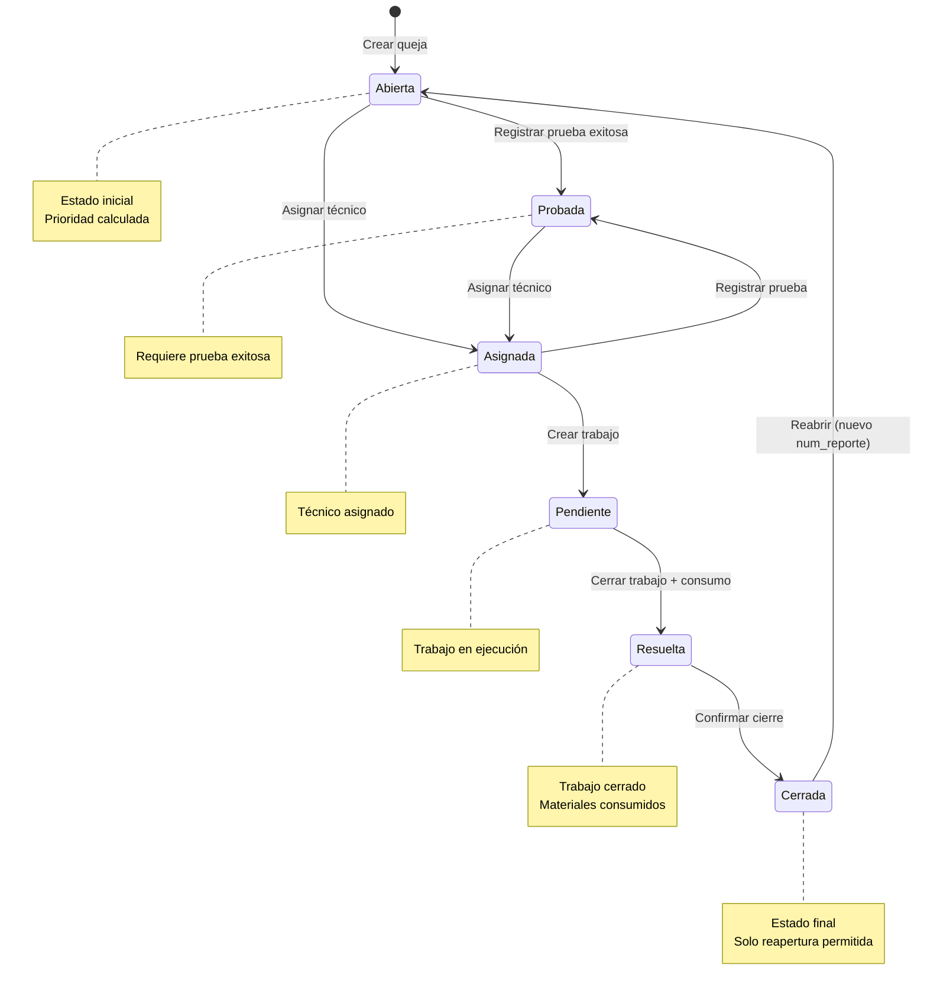
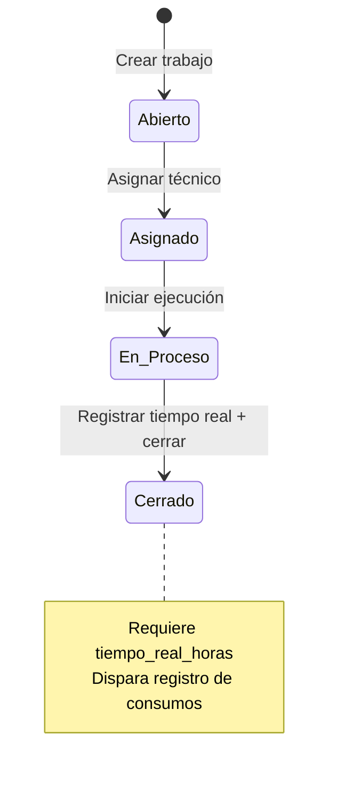
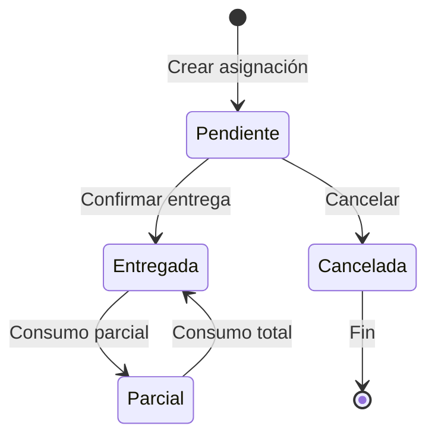
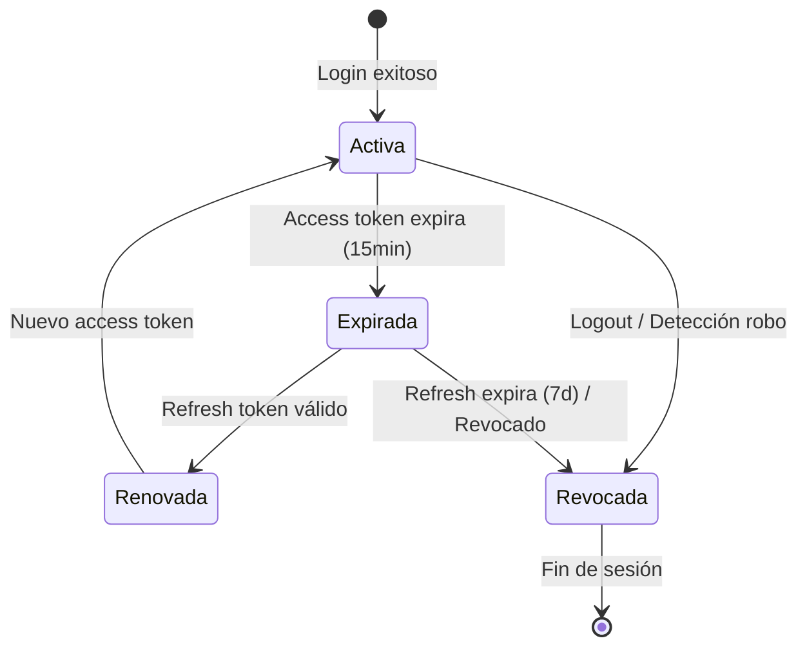

# Máquinas de Estado - SISGAD5

> **Versión:** 1.0  
> **Fecha:** 2026-09-25

---

## 1. Máquina de Estado: Queja (MP Service)

### Estados
```
Abierta → Probada → Asignada → Pendiente → Resuelta → Cerrada
   │         │          │           │           │          │
   └─────────┴──────────┴───────────┴───────────┴──────────┘
                    (Reabrir: Cerrada → Abierta)
```

### Transiciones Permitidas

| Estado Actual | Estado Siguiente | Actor | Condición | Acción |
|---------------|------------------|-------|-----------|--------|
| Abierta | Probada | Técnico | Prueba registrada (exitoso=true) | Registrar prueba, cambiar estado |
| Abierta | Asignada | Jefe/Operador | Técnico asignado | Asignar técnico |
| Probada | Asignada | Jefe/Operador | Técnico asignado | Asignar técnico |
| Asignada | Pendiente | Técnico | Trabajo creado | Crear orden de trabajo |
| Asignada | Probada | Técnico | Prueba registrada | Registrar prueba |
| Pendiente | Resuelta | Técnico | Trabajo cerrado + consumo registrado | Cerrar trabajo, registrar consumo |
| Resuelta | Cerrada | Operador/Jefe | Confirmación final | Cambiar estado |
| Cerrada | Abierta | Operador/Jefe | Reapertura justificada | Nuevo num_reporte, estado=Abierta |

### Transiciones PROHIBIDAS (Bloqueadas por RN-QUE-03)
- Abierta → Pendiente (saltar Probada/Asignada)
- Abierta → Resuelta (saltar estados intermedios)
- Abierta → Cerrada (saltar todos)
- Probada → Pendiente (saltar Asignada)
- Probada → Resuelta (saltar Asignada/Pendiente)
- Probada → Cerrada (saltar todos)
- Asignada → Resuelta (saltar Pendiente)
- Asignada → Cerrada (saltar Pendiente/Resuelta)
- Pendiente → Cerrada (saltar Resuelta)
- Cualquier → Abierta (excepto Cerrada → Abierta por reapertura)

### Diagrama Mermaid



### Eventos de Dominio (Event Storming)

| Evento | Trigger | Datos |
|--------|---------|-------|
| QuejaCreada | POST /quejas | {id, num_reporte, prioridad, estado: "Abierta"} |
| QuejaProbada | PATCH /quejas/:id (estado=Probada) | {id, prueba_id, tecnico_id} |
| QuejaAsignada | PATCH /quejas/:id/asignar | {id, tecnico_id, estado_anterior, estado_nuevo} |
| TrabajoCreado | POST /trabajos | {id, queja_id, tecnico_id} |
| TrabajoCerrado | PATCH /trabajos/:id/cerrar | {id, tiempo_real} |
| ConsumoRegistrado | POST /consumos | {id, trabajo_id, items} |
| QuejaResuelta | PATCH /quejas/:id (estado=Resuelta) | {id} |
| QuejaCerrada | PATCH /quejas/:id (estado=Cerrada) | {id} |
| QuejaReabierta | PATCH /quejas/:id (estado=Abierta desde Cerrada) | {id, nuevo_num_reporte} |

---

## 2. Máquina de Estado: Trabajo (MP Service)

### Estados
```
Abierto → Asignado → En_Proceso → Cerrado
```

### Transiciones Permitidas

| Estado Actual | Estado Siguiente | Actor | Condición |
|---------------|------------------|-------|-----------|
| Abierto | Asignado | Jefe | Técnico asignado |
| Asignado | En_Proceso | Técnico | Inicio de ejecución |
| En_Proceso | Cerrado | Técnico | Tiempo real registrado |

### Diagrama Mermaid



---

## 3. Máquina de Estado: Asignación (Materials Service)

### Estados
```
Pendiente → Entregada → Parcial → (Cancelada)
                    │
                    └─→ (si todos los items consumidos completamente)
```

### Transiciones Permitidas

| Estado Actual | Estado Siguiente | Condición |
|---------------|------------------|-----------|
| Pendiente | Entregada | Técnico confirma recepción |
| Pendiente | Cancelada | Analista cancela antes de entrega |
| Entregada | Parcial | Algunos items consumidos |
| Parcial | Entregada | Todos los items consumidos |

### Diagrama Mermaid



---

## 4. Máquina de Estado: Sesión (Auth Context)

### Estados
```
Activa → Expirada → Renovada → Activa
    │                        │
    └──────── Revocada ─────┘
         (Logout / Seguridad)
```

### Transiciones

| Estado Actual | Estado Siguiente | Trigger |
|---------------|------------------|---------|
| Activa | Expirada | access_token expira (15 min) |
| Expirada | Renovada | POST /auth/refresh con refresh_token válido |
| Renovada | Activa | Nuevo access_token emitido |
| Activa | Revocada | POST /auth/logout O detección robo refresh |
| Expirada | Revocada | Refresh_token expira (7 días) O revocado |

### Diagrama Mermaid



---

## 5. Máquina de Estado: Usuario (Users Context)

### Estados
```
Activo → Bloqueado → Activo
   │           │
   └───────────┴──→ Inactivo (baja lógica)
```

### Transiciones

| Estado Actual | Estado Siguiente | Trigger |
|---------------|------------------|---------|
| Activo | Bloqueado | 5 intentos fallidos login |
| Bloqueado | Activo | Expiración bloqueo (15 min) O admin desbloquea |
| Activo | Inactivo | Admin da de baja (soft delete) |
| Inactivo | Activo | Admin reactiva |

---

## 6. Diagramas Fuente

Ver archivos Mermaid en: [`docs/diagrams/state_machines/`](../diagrams/state_machines/)

- `queja_state.mmd`
- `trabajo_state.mmd`
- `asignacion_state.mmd`
- `sesion_state.mmd`
- `usuario_state.mmd`

---

## 7. Referencias

- [Reglas de Negocio](06_business_rules.md)
- [Casos de Uso](03_use_cases.md)
- [Modelo de Dominio](07_domain_model.md)
- [Diagramas de Secuencia](08_sequence_diagrams.md)
- [Event Storming](../practices/practice_03_event_storming.md)