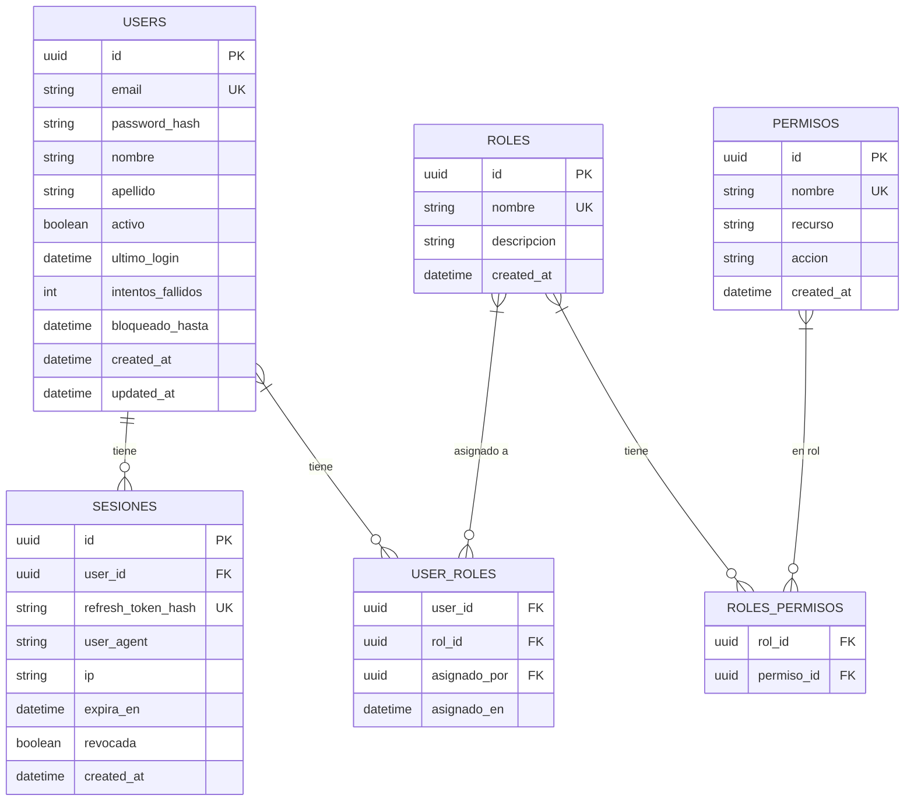
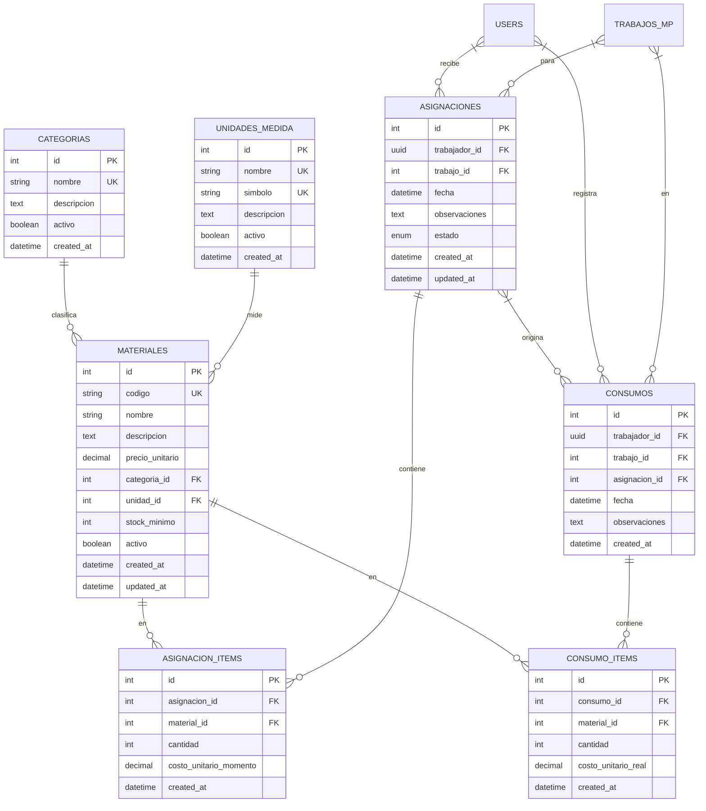

# Modelo de Datos (ER Consolidado) - SISGAD5

> **Versión:** 1.0  
> **Fecha:** 2026-09-25  
> **Bases de Datos:** 3 instancias PostgreSQL (bd_users, bd_mp, bd_materiales)

---

## 1. Resumen de Bases de Datos

| BD | Servicio | Esquema | Tablas Principales |
|----|----------|---------|-------------------|
| **bd_users** | Users Service | `public` | users, roles, permisos, sesiones, user_roles, roles_permisos |
| **bd_mp** | MP Service | `public` | telefonos, lineas, pizarras, puertos, quejas, flujo_estado_queja, pruebas, trabajos, catálogos MP |
| **bd_materiales** | Materials Service | `public` | materiales, categorias, unidades_medida, asignaciones, asignacion_items, consumos, consumo_items |

---

## 2. BD: bd_users (Users Service)

### Diagrama ER



### Tablas y Columnas

#### users
| Columna | Tipo | Nullable | Default | Índices |
|---------|------|----------|---------|---------|
| id | UUID | NO | gen_random_uuid() | PK |
| email | VARCHAR(255) | NO | - | UK |
| password_hash | VARCHAR(255) | NO | - | - |
| nombre | VARCHAR(100) | NO | - | - |
| apellido | VARCHAR(100) | NO | - | - |
| activo | BOOLEAN | NO | true | - |
| ultimo_login | TIMESTAMPTZ | SÍ | NULL | - |
| intentos_fallidos | INTEGER | NO | 0 | - |
| bloqueado_hasta | TIMESTAMPTZ | SÍ | NULL | - |
| created_at | TIMESTAMPTZ | NO | now() | - |
| updated_at | TIMESTAMPTZ | NO | now() | - |

#### sesiones
| Columna | Tipo | Nullable | Default | Índices |
|---------|------|----------|---------|---------|
| id | UUID | NO | gen_random_uuid() | PK |
| user_id | UUID | NO | - | FK, IDX |
| refresh_token_hash | VARCHAR(255) | NO | - | UK |
| user_agent | TEXT | SÍ | NULL | - |
| ip | VARCHAR(45) | SÍ | NULL | - |
| expira_en | TIMESTAMPTZ | NO | - | IDX |
| revocada | BOOLEAN | NO | false | - |
| created_at | TIMESTAMPTZ | NO | now() | - |

#### roles
| Columna | Tipo | Nullable | Default | Índices |
|---------|------|----------|---------|---------|
| id | UUID | NO | gen_random_uuid() | PK |
| nombre | VARCHAR(50) | NO | - | UK |
| descripcion | TEXT | SÍ | NULL | - |
| created_at | TIMESTAMPTZ | NO | now() | - |

#### permisos
| Columna | Tipo | Nullable | Default | Índices |
|---------|------|----------|---------|---------|
| id | UUID | NO | gen_random_uuid() | PK |
| nombre | VARCHAR(100) | NO | - | UK |
| recurso | VARCHAR(50) | NO | - | - |
| accion | VARCHAR(20) | NO | - | - |
| created_at | TIMESTAMPTZ | NO | now() | - |

#### user_roles
| Columna | Tipo | Nullable | Default | Índices |
|---------|------|----------|---------|---------|
| user_id | UUID | NO | - | PK, FK |
| rol_id | UUID | NO | - | PK, FK |
| asignado_por | UUID | NO | - | FK |
| asignado_en | TIMESTAMPTZ | NO | now() | - |

#### roles_permisos
| Columna | Tipo | Nullable | Default | Índices |
|---------|------|----------|---------|---------|
| rol_id | UUID | NO | - | PK, FK |
| permiso_id | UUID | NO | - | PK, FK |

---

## 3. BD: bd_mp (MP Service)

### Diagrama ER

```mermaid
erDiagram
    TELEFONOS ||--o{ QUEJAS : "tiene"
    LINEAS ||--o{ QUEJAS : "tiene"
    PIZARRAS ||--o{ QUEJAS : "tiene"
    PIZARRAS ||--o{ PUERTOS : "tiene"
    PUERTOS }o--o{ TELEFONOS : "conecta"
    PUERTOS }o--o{ LINEAS : "conecta"
    PUERTOS }o--o{ PIZARRAS : "conecta"
    QUEJAS ||--o{ FLUJO_ESTADO_QUEJA : "genera"
    QUEJAS ||--o{ PRUEBAS : "tiene"
    QUEJAS ||--o{ TRABAJOS : "genera"
    TRABAJOS ||--o{ PRUEBAS : "tiene"
    USERS }|--o{ QUEJAS : "asignado"
    USERS }|--o{ TRABAJOS : "asignado"
    USERS }|--o{ PRUEBAS : "ejecuta"
    TIPO_QUEJA ||--o{ QUEJAS : "clasifica"
    SERVICIO ||--o{ QUEJAS : "afecta"
    UBICACION ||--o{ QUEJAS : "localiza"
    CLAVE ||--o{ QUEJAS : "clasifica"
    
    TELEFONOS {
        int id PK
        string numero UK
        int cliente_id
        enum estado
        datetime fecha_baja
        string ubicacion
        text observaciones
        datetime created_at
        datetime updated_at
    }
    
    LINEAS {
        int id PK
        string numero UK
        int cliente_id
        enum estado
        datetime fecha_baja
        int tipo_linea_id FK
        datetime created_at
        datetime updated_at
    }
    
    PIZARRAS {
        int id PK
        string nombre
        int tipo_pizarra_id FK
        string ubicacion_fisica
        decimal latitud
        decimal longitud
        enum estado
        datetime fecha_baja
        datetime created_at
        datetime updated_at
    }
    
    PUERTOS {
        int id PK
        int pizarra_id FK
        int numero_puerto
        enum tipo_conexion
        int elemento_conectado_id
        string elemento_conectado_tipo
        datetime created_at
    }
    
    QUEJAS {
        int id PK
        int num_reporte UK
        int telefono_id FK
        int linea_id FK
        int pizarra_id FK
        int tipo_queja_id FK
        int servicio_id FK
        int ubicacion_id FK
        int clave_id FK
        string reportado_por
        int prioridad
        enum estado
        datetime fecha
        uuid tecnico_asignado_id FK
        datetime created_at
        datetime updated_at
    }
    
    FLUJO_ESTADO_QUEJA {
        int id PK
        int queja_id FK
        enum estado_anterior
        enum estado_nuevo
        uuid usuario_id FK
        text observaciones
        string ip
        datetime created_at
    }
    
    PRUEBAS {
        int id PK
        int queja_id FK
        int trabajo_id FK
        uuid tecnico_id FK
        datetime fecha
        boolean exitoso
        json mediciones
        text observaciones
        datetime created_at
    }
    
    TRABAJOS {
        int id PK
        int queja_id FK
        text descripcion
        uuid tecnico_asignado_id FK
        decimal tiempo_estimado_horas
        decimal tiempo_real_horas
        enum estado
        datetime fecha_creacion
        datetime fecha_asignacion
        datetime fecha_cierre
        datetime created_at
        datetime updated_at
    }
    
    TIPO_QUEJA { int id PK, string nombre UK }
    SERVICIO { int id PK, string nombre UK }
    UBICACION { int id PK, string nombre UK }
    CLAVE { int id PK, string codigo UK, int tipo_queja_id FK, int servicio_id FK, int ubicacion_id FK }
    TIPO_LINEA { int id PK, string nombre UK }
    TIPO_PIZARRA { int id PK, string nombre UK }
```

### Catálogos MP (Tablas de Referencia)

| Tabla | Descripción | Columnas Clave |
|-------|-------------|----------------|
| `tipo_queja` | Tipos de incidencia | id, nombre, peso_prioridad, activo |
| `servicio` | Servicios afectados | id, nombre, peso_prioridad, activo |
| `ubicacion` | Zonas geográficas | id, nombre, peso_prioridad, activo |
| `clave` | Clasificación compuesta | id, codigo, tipo_queja_id, servicio_id, ubicacion_id |
| `tipo_linea` | Tipos de línea | id, nombre, activo |
| `tipo_pizarra` | Tipos de pizarra | id, nombre, activo |
| `clasificacion` | Clasificaciones adicionales | id, nombre, activo |
| `clasificador_clave` | Claves jerárquicas | id, codigo, padre_id, nombre, activo |
| `cable` | Tipos de cable | id, nombre, especificacion, activo |
| `senalizacion` | Tipos de señalización | id, nombre, activo |
| `sistema` | Sistemas de conmutación | id, nombre, activo |
| `planta` | Plantas/Edificios | id, nombre, direccion, activo |
| `propietario` | Propietarios infraestructura | id, nombre, contacto, activo |
| `mandos` | Mandos de conmutación | id, nombre, tipo, activo |
| `grupos_trabajo` | Grupos de trabajo | id, nombre, descripcion, activo |
| `tipo_movimiento` | Tipos de movimiento | id, nombre, activo |

---

## 4. BD: bd_materiales (Materials Service)

### Diagrama ER



### Tablas y Columnas

#### materiales
| Columna | Tipo | Nullable | Default | Índices |
|---------|------|----------|---------|---------|
| id | SERIAL | NO | - | PK |
| codigo | VARCHAR(50) | NO | - | UK |
| nombre | VARCHAR(200) | NO | - | IDX |
| descripcion | TEXT | SÍ | NULL | - |
| precio_unitario | DECIMAL(12,2) | NO | - | CHECK > 0 |
| categoria_id | INTEGER | NO | - | FK, IDX |
| unidad_id | INTEGER | NO | - | FK, IDX |
| stock_minimo | INTEGER | NO | 0 | - |
| activo | BOOLEAN | NO | true | - |
| created_at | TIMESTAMPTZ | NO | now() | - |
| updated_at | TIMESTAMPTZ | NO | now() | - |

#### categorias
| Columna | Tipo | Nullable | Default | Índices |
|---------|------|----------|---------|---------|
| id | SERIAL | NO | - | PK |
| nombre | VARCHAR(100) | NO | - | UK |
| descripcion | TEXT | SÍ | NULL | - |
| activo | BOOLEAN | NO | true | - |
| created_at | TIMESTAMPTZ | NO | now() | - |

#### unidades_medida
| Columna | Tipo | Nullable | Default | Índices |
|---------|------|----------|---------|---------|
| id | SERIAL | NO | - | PK |
| nombre | VARCHAR(50) | NO | - | UK |
| simbolo | VARCHAR(20) | NO | - | UK |
| descripcion | TEXT | SÍ | NULL | - |
| activo | BOOLEAN | NO | true | - |
| created_at | TIMESTAMPTZ | NO | now() | - |

#### asignaciones
| Columna | Tipo | Nullable | Default | Índices |
|---------|------|----------|---------|---------|
| id | SERIAL | NO | - | PK |
| trabajador_id | UUID | NO | - | FK, IDX |
| trabajo_id | INTEGER | SÍ | NULL | FK, IDX |
| fecha | TIMESTAMPTZ | NO | now() | - |
| observaciones | TEXT | SÍ | NULL | - |
| estado | VARCHAR(20) | NO | 'Pendiente' | CHECK IN (...) |
| created_at | TIMESTAMPTZ | NO | now() | - |
| updated_at | TIMESTAMPTZ | NO | now() | - |

#### asignacion_items
| Columna | Tipo | Nullable | Default | Índices |
|---------|------|----------|---------|---------|
| id | SERIAL | NO | - | PK |
| asignacion_id | INTEGER | NO | - | FK, IDX |
| material_id | INTEGER | NO | - | FK, IDX |
| cantidad | INTEGER | NO | - | CHECK > 0 |
| costo_unitario_momento | DECIMAL(12,2) | NO | - | CHECK > 0 |
| created_at | TIMESTAMPTZ | NO | now() | - |

#### consumos
| Columna | Tipo | Nullable | Default | Índices |
|---------|------|----------|---------|---------|
| id | SERIAL | NO | - | PK |
| trabajador_id | UUID | NO | - | FK, IDX |
| trabajo_id | INTEGER | NO | - | FK, IDX |
| asignacion_id | INTEGER | SÍ | NULL | FK, IDX |
| fecha | TIMESTAMPTZ | NO | now() | - |
| observaciones | TEXT | SÍ | NULL | - |
| created_at | TIMESTAMPTZ | NO | now() | - |

#### consumo_items
| Columna | Tipo | Nullable | Default | Índices |
|---------|------|----------|---------|---------|
| id | SERIAL | NO | - | PK |
| consumo_id | INTEGER | NO | - | FK, IDX |
| material_id | INTEGER | NO | - | FK, IDX |
| cantidad | INTEGER | NO | - | CHECK > 0 |
| costo_unitario_real | DECIMAL(12,2) | NO | - | CHECK > 0 |
| created_at | TIMESTAMPTZ | NO | now() | - |

---

## 5. Vistas Útiles (Propuestas)

### Vista: stock_logico_trabajador (Materials)
```sql
CREATE VIEW stock_logico_trabajador AS
SELECT 
    ai.trabajador_id,
    mi.material_id,
    m.codigo,
    m.nombre,
    SUM(ai.cantidad) AS total_asignado,
    COALESCE(SUM(ci.cantidad), 0) AS total_consumido,
    SUM(ai.cantidad) - COALESCE(SUM(ci.cantidad), 0) AS saldo_logico
FROM asignacion_items ai
JOIN asignaciones a ON ai.asignacion_id = a.id
JOIN materiales m ON ai.material_id = m.id
LEFT JOIN consumo_items ci ON ci.material_id = m.id
LEFT JOIN consumos c ON ci.consumo_id = c.id AND c.trabajador_id = a.trabajador_id
WHERE a.estado IN ('Entregada', 'Parcial')
GROUP BY ai.trabajador_id, mi.material_id, m.codigo, m.nombre;
```

### Vista: quejas_con_detalles (MP)
```sql
CREATE VIEW quejas_con_detalles AS
SELECT 
    q.*,
    t.numero AS telefono_numero,
    l.numero AS linea_numero,
    p.nombre AS pizarra_nombre,
    tq.nombre AS tipo_queja,
    s.nombre AS servicio,
    u.nombre AS ubicacion,
    c.codigo AS clave_codigo,
    tec.nombre || ' ' || tec.apellido AS tecnico_nombre
FROM quejas q
LEFT JOIN telefonos t ON q.telefono_id = t.id
LEFT JOIN lineas l ON q.linea_id = l.id
LEFT JOIN pizarras p ON q.pizarra_id = p.id
LEFT JOIN tipo_queja tq ON q.tipo_queja_id = tq.id
LEFT JOIN servicio s ON q.servicio_id = s.id
LEFT JOIN ubicacion u ON q.ubicacion_id = u.id
LEFT JOIN clave c ON q.clave_id = c.id
LEFT JOIN users tec ON q.tecnico_asignado_id = tec.id;
```

---

## 6. Migraciones y Versionado

| Servicio | Herramienta | Ubicación |
|----------|-------------|-----------|
| Users | Sequelize CLI | `backend-users/migrations/`, `backend-users/seeders/` |
| MP | Sequelize CLI | `backend-mp/migrations/`, `backend-mp/seeders/` |
| Materials | Golang Migrate | `backend-materiales-go/migrations/` |

---

## 7. Referencias

- [Modelo de Dominio](07_domain_model.md)
- [Reglas de Negocio](06_business_rules.md)
- [Casos de Uso](03_use_cases.md)
- [Diagramas ER fuente](diagrams/er_diagrams/)