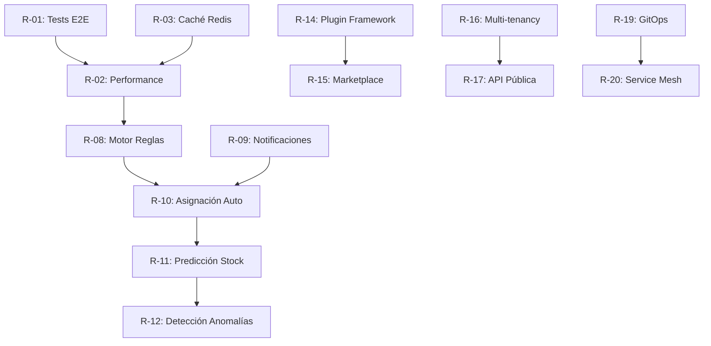

# Roadmap de Evolución - SISGAD5

> **Versión:** 1.0  
> **Fecha:** 2026-09-25  
> **Horizonte:** 24 meses (Fases 0-12 completadas → Mantenimiento y Evolución)

---

## 1. Visión a Largo Plazo

**SISGAD5** evoluciona de un sistema de gestión de telecomunicaciones a una **plataforma integral de operaciones de red** con capacidades de analítica predictiva, automatización inteligente y extensibilidad multi-dominio.

### Objetivos Estratégicos
1. **Automatización:** Reducir intervención manual 60% en 18 meses
2. **Inteligencia:** Predicción de fallos y optimización de recursos
3. **Escalabilidad:** Soportar 10x carga actual sin rediseño
4. **Extensibilidad:** Framework de plugins para nuevos dominios (TV, Internet, 5G)
5. **Experiencia:** UX unificada, móvil-first, accesible

---

## 2. Roadmap por Trimestres

### Q4 2026 (Actual - Fase 12: Mantenimiento)
| Iniciativa | Estado | Esfuerzo | Responsable |
|------------|--------|----------|-------------|
| Estabilización v1.0 | ✅ Completo | - | Equipo |
| Documentación completa | 🔄 En progreso | 🏗️ 1-3 días | Tech Writer |
| Monitoreo producción | ⏳ Pendiente | 🏗️ 1-3 días | DevOps |
| Seguridad hardening | ⏳ Pendiente | 🏗️ 1-3 días | SecOps |
| Soporte 24/7 | ⏳ Pendiente | 🏛️ > 3 días | Ops |

---

### Q1 2027 - Consolidación y Calidad

| ID | Iniciativa | Descripción | Esfuerzo | Prioridad |
|----|------------|-------------|----------|-----------|
| R-01 | **Tests E2E Completos** | Cubrir 100% flujos críticos con Playwright | 🏗️ 1-3 días | 🔴 Crítica |
| R-02 | **Performance Baseline** | Establecer métricas base, optimizar queries lentas | 🏗️ 1-3 días | 🔴 Crítica |
| R-03 | **Caché Distribuido** | Redis para sesiones, catálogos MP, dashboard KPIs | 🏗️ 1-3 días | 🟡 Alta |
| R-04 | **API Versioning** | Estrategia v1/v2, deprecación gradual | 🏗️ 1-3 días | 🟡 Alta |
| R-05 | **Backup/DR Automatizado** | Restore probado mensual, RPO < 1h, RTO < 4h | 🏗️ 1-3 días | 🔴 Crítica |
| R-06 | **Accesibilidad WCAG 2.1 AA** | Auditoría y corrección frontend | 🏗️ 1-3 días | 🟡 Alta |
| R-07 | **Internacionalización Completa** | ES/RU en todos los módulos, fechas/monedas locales | 🏗️ 1-3 días | 🟡 Alta |

---

### Q2 2027 - Automatización e Inteligencia

| ID | Iniciativa | Descripción | Esfuerzo | Prioridad |
|----|------------|-------------|----------|-----------|
| R-08 | **Motor de Reglas (Drools/JSON Logic)** | Externalizar reglas de negocio (prioridad, flujo estados) | 🏛️ > 3 días | 🟡 Alta |
| R-09 | **Notificaciones Push/Real-time** | WebSockets + Service Workers para alertas instantáneas | 🏗️ 1-3 días | 🟡 Alta |
| R-10 | **Asignación Automática Técnicos** | Algoritmo: cercanía + carga + especialidad + disponibilidad | 🏛️ > 3 días | 🟢 Media |
| R-11 | **Predicción Stock Materiales** | ML simple: serie temporal → alerta reposición anticipada | 🏛️ > 3 días | 🟢 Media |
| R-12 | **Detección Anomalías Quejas** | Patrones: repeticiones, clustering geográfico, estacionalidad | 🏛️ > 3 días | 🟢 Media |
| R-13 | **Chatbot Soporte Nivel 1** | FAQ automático, creación queja guiada, estado consulta | 🏗️ 1-3 días | 🟢 Media |

---

### Q3 2027 - Extensibilidad y Plataforma

| ID | Iniciativa | Descripción | Esfuerzo | Prioridad |
|----|------------|-------------|----------|-----------|
| R-14 | **Plugin Framework** | SDK para módulos externos (TV, Internet, IoT, 5G) | 🏛️ > 3 días | 🟢 Media |
| R-15 | **Marketplace Interno** | Catálogo de plugins, versionado, dependencias | 🏛️ > 3 días | ⚪ Baja |
| R-16 | **Multi-tenancy** | Aislamiento lógico para múltiples direcciones/empresas | 🏛️ > 3 días | 🟢 Media |
| R-17 | **API Pública Documentada** | Portal desarrolladores, rate limiting por cliente, OAuth2 | 🏗️ 1-3 días | 🟢 Media |
| R-18 | **Event Sourcing + CQRS** | Auditoría completa, replay, proyecciones read-optimized | 🏛️ > 3 días | ⚪ Baja |

---

### Q4 2027 - Madurez Operacional

| ID | Iniciativa | Descripción | Esfuerzo | Prioridad |
|----|------------|-------------|----------|-----------|
| R-19 | **GitOps Completo** | ArgoCD/Flux, environments as code, progressive delivery | 🏗️ 1-3 días | 🟡 Alta |
| R-20 | **Service Mesh (Istio/Linkerd)** | mTLS, traffic splitting, observabilidad avanzada | 🏛️ > 3 días | 🟢 Media |
| R-21 | **Chaos Engineering** | Experimentos programados: latencia, fallos, partición red | 🏗️ 1-3 días | 🟢 Media |
| R-22 | **FinOps** | Costos por servicio/equipo, alertas presupuesto, optimización | 🏗️ 1-3 días | 🟢 Media |
| R-23 | **Compliance Automatizado** | Políticas OPA/Gatekeeper, auditoría continua | 🏗️ 1-3 días | 🟢 Media |

---

## 3. Backlog Técnico (Deuda y Mejora Continua)

| Área | Items |
|------|-------|
| **Backend Users** | Migrar a TypeScript, OpenAPI first, GraphQL gateway |
| **Backend MP** | Separar dominio quejas/trabajos en microservicios, event-driven |
| **Backend Materials** | gRPC interno, cache Redis, background jobs (Asynq) |
| **Frontend** | Micro-frontends, Storybook, visual regression tests, PWA |
| **Infraestructura** | IaC completo (Terraform/Pulumi), policy as code |
| **Datos** | Data lake (Parquet), ELT (dbt), ML platform (MLflow) |

---

## 4. Métricas de Éxito (KPIs de Evolución)

| Métrica | Actual (Q4 2026) | Objetivo Q4 2027 |
|---------|------------------|------------------|
| **Cobertura Tests** | ~25% | ≥ 80% |
| **Frecuencia Deploy** | Semanal | Diaria (main) |
| **Lead Time Cambios** | 2-3 días | < 4 horas |
| **MTTR (Incidentes)** | 2-4 horas | < 30 min |
| **Change Failure Rate** | ~15% | < 5% |
| **Disponibilidad** | 99.5% | 99.9% |
| **Latencia p95 API** | ~300ms | < 150ms |
| **Usuarios Concurrentes** | 100 | 500+ |
| **Satisfacción Usuario** | N/A | > 4.5/5 |

---

## 5. Dependencias Críticas

---

## 6. Recursos Necesarios

| Rol | Q4 2026 | Q1 2027 | Q2 2027 | Q3 2027 | Q4 2027 |
|-----|---------|---------|---------|---------|---------|
| **Backend Developers** | 2 | 3 | 3 | 3 | 2 |
| **Frontend Developer** | 1 | 1 | 1 | 1 | 1 |
| **DevOps/Platform** | 1 | 1 | 1 | 1 | 1 |
| **QA/Automation** | 0.5 | 1 | 1 | 1 | 1 |
| **Data/ML Engineer** | 0 | 0 | 0.5 | 1 | 1 |
| **Tech Writer** | 0.5 | 0.5 | 0.5 | 0.5 | 0.5 |
| **Product Owner** | 0.5 | 0.5 | 0.5 | 0.5 | 0.5 |

---

## 7. Riesgos y Mitigación

| Riesgo | Probabilidad | Impacto | Mitigación |
|--------|--------------|---------|------------|
| **Fuga de conocimiento** (equipo pequeño) | Alta | Crítico | Documentación exhaustiva, pair programming, bus factor ≥ 2 |
| **Deuda técnica acumulada** | Media | Alto | 20% sprint capacity para refactoring, ADRs obligatorios |
| **Cambios requisitos regulación** | Media | Medio | Arquitectura modular, feature flags, configuración externalizada |
| **Escalabilidad BD no prevista** | Baja | Crítico | Load testing continuo, read replicas, particionado planificado |
| **Dependencia proveedor cloud** | Media | Medio | Multi-cloud strategy, contenedores portables, evitar lock-in |

---

## 8. Governance

### 8.1 Rituales
| Ritual | Frecuencia | Participantes | Output |
|--------|------------|---------------|--------|
| **Sprint Planning** | 2 semanas | Equipo completo | Sprint backlog |
| **Daily Standup** | Diario | Devs + PO | Sync, blockers |
| **Architecture Review** | Mensual | Tech Lead + Devs | ADRs, decisiones |
| **Retrospective** | 2 semanas | Equipo completo | Mejoras proceso |
| **Roadmap Review** | Trimestral | PO + Tech Lead + Stakeholders | Roadmap actualizado |

### 8.2 Decision Log (ADRs)
- Ubicación: `docs/adr/`
- Formato: MADR (Markdown Architectural Decision Records)
- Requerido para: Cambios arquitectónicos, elección tecnológica, patrones

---

## 9. Referencias

- [TASKLIST.md](../TASKLIST.md) - Tareas detalladas por fase
- [SPEC.md](../SPEC.md) - Especificación técnica base
- [Arquitectura](../ARCHITECTURE.md) - Decisiones arquitectónicas
- [Guía de Operación](15_operations.md) - Operación actual
- [Testing](16_testing.md) - Estrategia de calidad