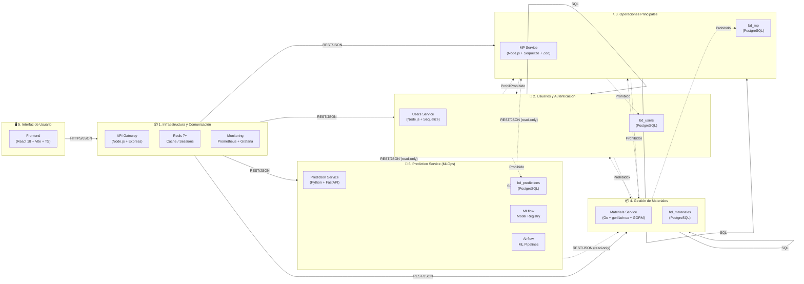

# 📦 Diagrama de Paquetes — SISGAD5

> **Tarea:** TASK-100-03
> **Tipo:** Diagrama UML de Paquetes
> **Estado:** ⏳ Pendiente

## Descripción

Este diagrama muestra la organización modular del sistema SISGAD5 en **5 paquetes principales** con sus reglas de dependencia. Los paquetes representan agrupaciones lógicas de componentes con responsabilidades bien definidas, siguiendo el principio de separación de preocupaciones y el patrón de microservicios.

---

## Diagrama de Paquetes (Mermaid)



---

## Reglas de Dependencia entre Paquetes

| #   | Regla                                                        | Justificación                                      |
| --- | ------------------------------------------------------------ | -------------------------------------------------- |
| R-P1 | El Frontend solo depende del paquete de Infraestructura (API Gateway) | Arquitectura de capas, control de acceso centralizado |
| R-P2 | El API Gateway depende de todos los servicios (Users, MP, Materials, Prediction) | Punto único de entrada, enrutamiento centralizado   |
| R-P3 | Cada paquete de servicio solo accede a su propia base de datos | Autonomía y escalabilidad independiente            |
| R-P4 | Prediction Service consume datos de otros servicios en modo read-only | Previsión sin modificar datos operativos          |
| R-P5 | **Prohibido** el acceso directo a BD de otro paquete          | Integridad y aislamiento de datos                  |
| R-P6 | **Prohibido** el acceso directo del Frontend a microservicios | Seguridad y control de autenticación               |

---

## Descripción de los Paquetes

### 1. Infraestructura y Comunicación
- **API Gateway**: Punto único de entrada, maneja JWT, rate limiting, CORS, logging, health checks
- **Redis**: Caché distribuido, sesiones de usuario, locks
- **Monitoring**: Prometheus (recolección), Grafana (visualización), Loki (logs)

### 2. Usuarios y Autenticación
- **Users Service**: Gestión de usuarios, roles RBAC, JWT + refresh tokens
- **bd_users**: Base de datos exclusiva de usuarios y roles

### 3. Operaciones Principales
- **MP Service**: Teléfonos, líneas, pizarras, quejas, pruebas, trabajos, estadísticas
- **bd_mp**: Base de datos exclusiva de operaciones

### 4. Gestión de Materiales
- **Materials Service**: Catálogo, categorías, unidades, asignaciones, consumos
- **bd_materiales**: Base de datos exclusiva de materiales

### 5. Interfaz de Usuario
- **Frontend**: Aplicación web React con Vite, TypeScript, Tailwind CSS
- Comunicação únicamente con el API Gateway

### 6. Prediction Service (MLOps)
- **Prediction Service**: Modelado predictivo vía FastAPI, endpoints `/api/predictions/*`
- **bd_predictions**: Base de datos exclusiva de predicciones y metadatos de modelos
- **MLflow**: Model Registry para versionamiento de modelos
- **Airflow**: Orquestación de pipelines de entrenamiento/reentrenamiento

---

## Diagrama de Paquetes (PlantUML)

```plantuml
@startuml
package "1. Infraestructura y Comunicación" {
  component GW as "API Gateway\n(Node.js + Express)"
  database RDX as "Redis 7+\nCache / Sessions"
  node OBS as "Monitoring\nPrometheus + Grafana"
}

package "2. Usuarios y Autenticación" {
  component US as "Users Service\n(Node.js + Sequelize)"
  database UBA as "bd_users\n(PostgreSQL)"
}

package "3. Operaciones Principales" {
  component MPS as "MP Service\n(Node.js + Sequelize + Zod)"
  database MPDB as "bd_mp\n(PostgreSQL)"
}

package "4. Gestión de Materiales" {
  component MS as "Materials Service\n(Go + gorilla/mux + GORM)"
  database MADB as "bd_materiales\n(PostgreSQL)"
}

package "5. Interfaz de Usuario" {
  component FE as "Frontend\n(React 18 + Vite + TS)"
}

package "6. Prediction Service (MLOps)" {
  component PS as "Prediction Service\n(Python + FastAPI)"
  database PDB as "bd_predictions\n(PostgreSQL)"
  node MLFLOW as "MLflow\nModel Registry"
  node AIRFLOW as "Airflow\nML Pipelines"
}

!define AWSPUML https://raw.githubusercontent.com/awslabs/aws-icons-for-plantuml/v14.0/LATEST/AWSPUML
!define ICONSIZE 40

' Allowed dependencies (solid lines)
FE --> GW : HTTPS/JSON
GW --> US : REST/JSON
GW --> MPS : REST/JSON
GW --> MS : REST/JSON
GW --> PS : REST/JSON
US --> UBA : SQL
MPS --> MPDB : SQL
MS --> MADB : SQL
PS --> PDB : SQL

' Read-only dependencies (dotted lines)
PS ..> US : REST/JSON (read-only)
PS ..> MPS : REST/JSON (read-only)
PS ..> MS : REST/JSON (read-only)

' Forbidden dependencies (dashed red)
style US..[#red,dashed]
style MPS..[#red,dashed]
style MS..[#red,dashed]

US -[hidden]-- UBA
US .[#red,dashed].> MPDB : Forbidden
US .[#red,dashed].> MADB : Forbidden
PS .[#red,dashed].> UBA : Forbidden
PS .[#red,dashed].> MPDB : Forbidden
PS .[#red,dashed].> MADB : Forbidden

@enduml
```

---

## Criterio de Aceptación

- [x] Diagrama muestra exactamente 6 paquetes (5 originales + Prediction Service)
- [x] Reglas de dependencia permitidas documentadas
- [x] Reglas de dependencia prohibidas documentadas
- [x] Cada paquete tiene responsabilidad bien definida
- [x] Prediction Service consume datos en modo read-only
- [x] Formato Mermaid renderizable
- [x] Formato PlantUML incluido
