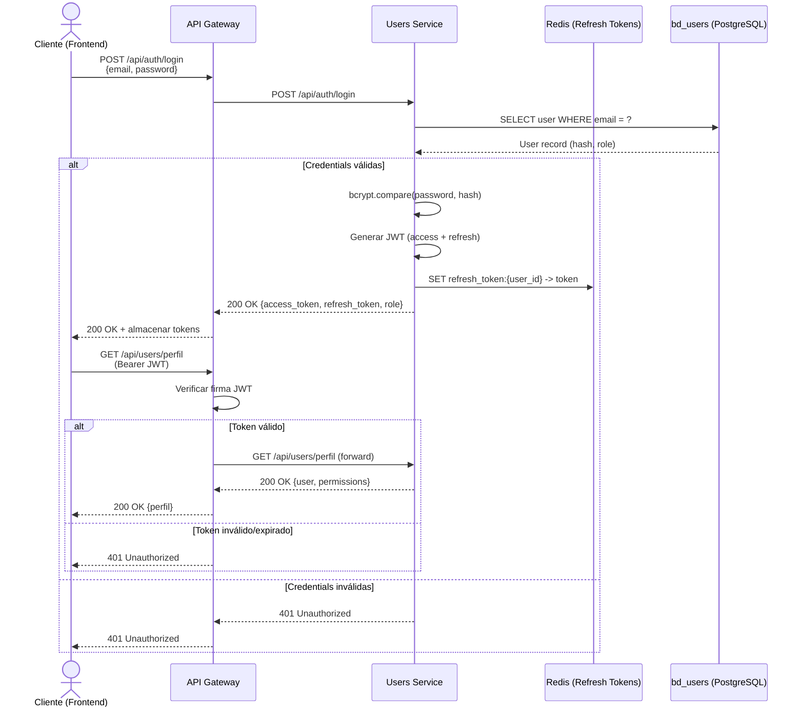
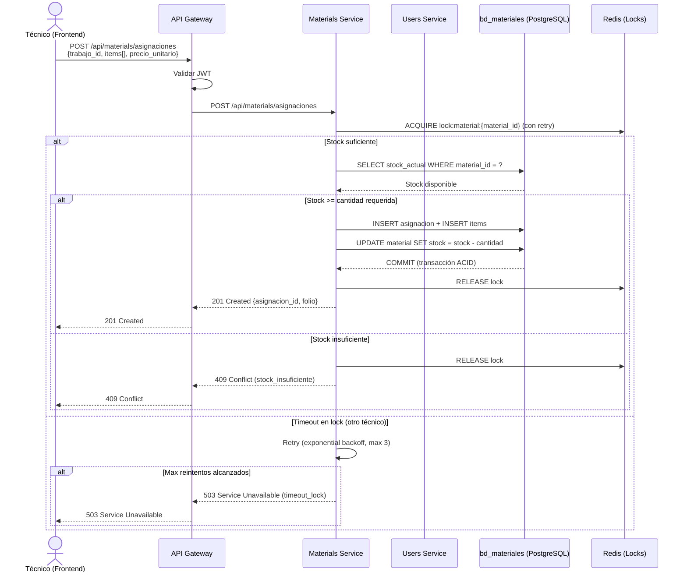
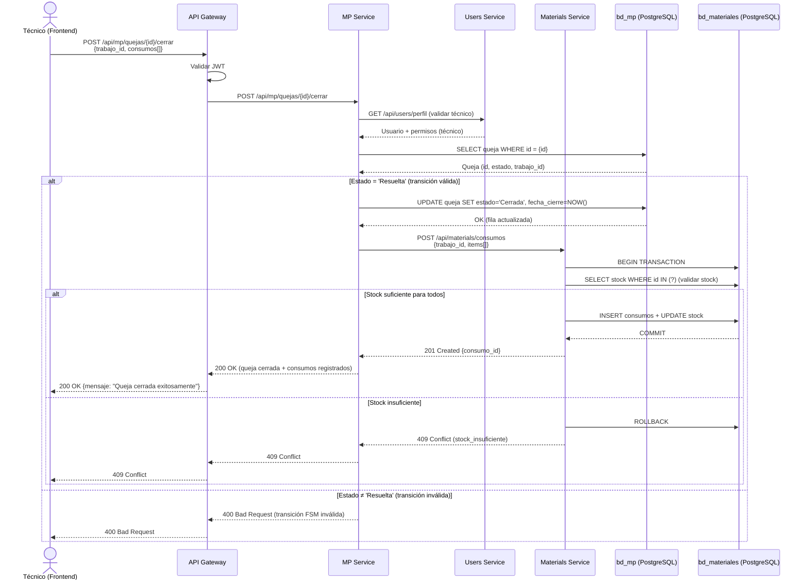
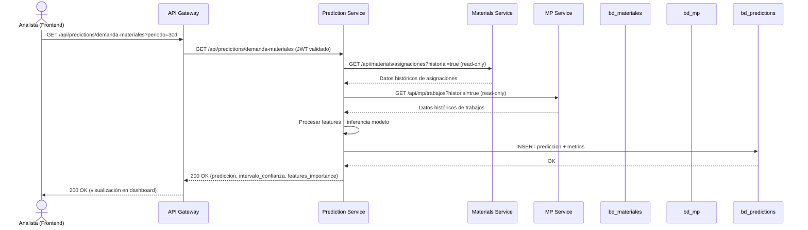

# 📊 Diagramas de Secuencia — SISGAD5

> **Tarea:** TASK-100-04
> **Tipo:** Diagramas UML de Secuencia
> **Estado:** ✅ Completada
> **Criterio:** 3 escenarios críticos con tablas de mensajes

---

## Escenario 1: Login y Autenticación con JWT

### Tabla de Mensajes — Login y Autenticación

| Paso | Emisor             | Mensaje                                          | Destino        | Protocolo | Descripción                                    |
| ---- | ------------------ | ------------------------------------------------ | -------------- | --------- | ---------------------------------------------- |
| 1    | Cliente (Frontend) | `POST /api/auth/login`                           | API Gateway    | HTTPS     | Envío de credenciales (email + password)       |
| 2    | API Gateway        | `POST /api/auth/login`                           | Users Service  | REST/JSON | Reenvío de credenciales al servicio             |
| 3    | Users Service      | `SELECT * FROM usuarios WHERE email = ?`         | bd_users       | SQL       | Búsqueda de usuario por email                   |
| 4    | bd_users           | User record (con hash de password y role)        | Users Service  | SQL       | Respuesta con datos del usuario                 |
| 5    | Users Service      | `bcrypt.compare(password, hash)`                 | —              | Internal  | Validación de contraseña                        |
| 6    | Users Service      | `JWT.sign({id, role, exp})`                      | —              | Internal  | Generación del access token (15 min)            |
| 7    | Users Service      | `JWT.sign({id, exp})`                            | —              | Internal  | Generación del refresh token (7 días)           |
| 8    | Users Service      | `SET refresh:{user_id} → token (TTL 7d)`         | Redis          | Redis     | Almacenamiento del refresh token                |
| 9    | Users Service      | `200 OK {access, refresh, role}`                 | API Gateway    | REST/JSON | Respuesta con tokens                            |
| 10   | API Gateway        | `200 OK {access, refresh, role}`                 | Cliente        | HTTPS     | Respuesta al frontend                           |
| 11   | Cliente (Frontend) | `GET /api/users/perfil` con `Authorization: Bearer {JWT}` | API Gateway | HTTPS     | Request autenticado al perfil de usuario        |
| 12   | API Gateway        | Verificar firma JWT, expiración                  | —              | Internal  | Validación del token                            |
| 13   | API Gateway        | `GET /api/users/perfil`                          | Users Service  | REST/JSON | Forward del request con user_id del JWT         |
| 14   | Users Service      | `SELECT * FROM usuarios WHERE id = ?`            | bd_users       | SQL       | Búsqueda del usuario por ID                     |
| 15   | Users Service      | `200 OK {perfil, permisos}`                      | API Gateway    | REST/JSON | Respuesta con datos del perfil                  |
| 16   | API Gateway        | `200 OK {perfil, permisos}`                      | Cliente        | HTTPS     | Respuesta al frontend                           |

---

## Escenario 2: Asignación de materiales con validación de stock

### Tabla de Mensajes — Asignación de Materiales

| Paso | Emisor             | Mensaje                                          | Destino        | Protocolo | Descripción                                    |
| ---- | ------------------ | ------------------------------------------------ | -------------- | --------- | ---------------------------------------------- |
| 1    | Técnico (Frontend) | `POST /api/materials/asignaciones`               | API Gateway    | HTTPS     | Solicitud de asignación de materiales          |
| 2    | API Gateway        | Verificar JWT                                    | —              | Internal  | Validación de autenticación                    |
| 3    | API Gateway        | `POST /api/materials/asignaciones`               | Materials Service | REST/JSON | Reenvío de la solicitud                       |
| 4    | Materials Service  | `SETNX lock:material:{id} (expiry 30s)`         | Redis          | Redis     | Adquisición de distributed lock                |
| 5    | Redis              | `OK` o `EXISTS`                                  | Materials Service | Redis     | Respuesta de lock                              |
| 6    | Materials Service  | `SELECT stock_actual WHERE id = ?`              | bd_materiales  | SQL       | Consulta de stock disponible                   |
| 7    | bd_materiales      | Stock disponible                                | Materials Service | SQL       | Respuesta con cantidad en stock                |
| 8    | Materials Service  | `BEGIN TRANSACTION`                             | bd_materiales  | SQL       | Inicio de transacción                          |
| 9    | Materials Service  | `INSERT INTO asignaciones` + `INSERT INTO items` | bd_materiales  | SQL       | Creación de registro de asignación             |
| 10   | Materials Service  | `UPDATE material SET stock = stock - n`         | bd_materiales  | SQL       | Decremento de stock                            |
| 11   | bd_materiales      | `COMMIT`                                        | Materials Service | SQL       | Confirmación atómica de la transacción         |
| 12   | Materials Service  | `DEL lock:material:{id}`                        | Redis          | Redis     | Liberación del lock                            |
| 13   | Materials Service  | `201 Created {asignacion_id, folio}`             | API Gateway    | REST/JSON | Confirmación de asignación creada              |
| 14   | API Gateway        | `201 Created`                                   | Técnico        | HTTPS     | Respuesta al frontend                          |
| 15   | Materials Service  | `409 Conflict` (stock_insuficiente)             | API Gateway    | REST/JSON | Error: stock insuficiente                      |
| 16   | Materials Service  | Retry con backoff exponencial (max 3 intentos)  | —              | Internal  | Reintento por lock ocupado                     |

---

## Escenario 3: Cierre de queja con consumo de materiales

### Tabla de Mensajes — Cierre de Queja con Consumo

| Paso | Emisor             | Mensaje                                          | Destino        | Protocolo | Descripción                                    |
| ---- | ------------------ | ------------------------------------------------ | -------------- | --------- | ---------------------------------------------- |
| 1    | Técnico (Frontend) | `POST /api/mp/quejas/{id}/cerrar`                | API Gateway    | HTTPS     | Cierre de queja con consumos de materiales     |
| 2    | API Gateway        | Verificar JWT                                    | —              | Internal  | Validación de autenticación                    |
| 3    | API Gateway        | `POST /api/mp/quejas/{id}/cerrar`                | MP Service     | REST/JSON | Forward de la solicitud                        |
| 4    | MP Service         | `GET /api/users/perfil`                          | Users Service  | REST/JSON | Validar usuario técnico y permisos             |
| 5    | Users Service      | `200 OK {user, permissions}`                    | MP Service     | REST/JSON | Confirmación de rol técnico                    |
| 6    | MP Service         | `SELECT * FROM quejas WHERE id = ?`             | bd_mp          | SQL       | Obtención del estado actual de la queja        |
| 7    | bd_mp              | Queja (id, estado, trabajo_id)                 | MP Service     | SQL       | Respuesta con datos de la queja                |
| 8    | MP Service         | Validar FSM: estado actual → 'Cerrada'          | —              | Internal  | Verificación de máquina de estados             |
| 9    | MP Service         | `UPDATE quejas SET estado='Cerrada'`            | bd_mp          | SQL       | Actualización del estado de la queja           |
| 10   | bd_mp              | `COMMIT`                                        | MP Service     | SQL       | Confirmación del cambio de estado              |
| 11   | MP Service         | `POST /api/materials/consumos`                  | Materials Service | REST/JSON | Registro de consumos de materiales        |
| 12   | Materials Service  | `BEGIN TRANSACTION`                             | bd_materiales  | SQL       | Inicio de transacción                          |
| 13   | Materials Service  | `SELECT stock WHERE id IN (?)`                  | bd_materiales  | SQL       | Validación de stock para todos los ítems       |
| 14   | bd_materiales      | Stock disponible                                | Materials Service | SQL       | Confirmación de stock suficiente               |
| 15   | Materials Service  | `INSERT consumos + UPDATE stock`                | bd_materiales  | SQL       | Registro de consumos y decremento de stock     |
| 16   | bd_materiales      | `COMMIT`                                        | Materials Service | SQL       | Confirmación atómica                           |
| 17   | Materials Service  | `201 Created`                                   | MP Service     | REST/JSON | Confirmación de consumos registrados           |
| 18   | MP Service         | `200 OK`                                        | API Gateway    | REST/JSON | Confirmación de cierre de queja                |
| 19   | API Gateway        | `200 OK`                                        | Técnico        | HTTPS     | Respuesta exitosa al frontend                  |
| 20   | Materials Service  | `409 Conflict` (stock_insuficiente)             | MP Service     | REST/JSON | Error: stock insuficiente                      |
| 21   | MP Service         | `ROLLBACK` + `409 Conflict`                      | API Gateway    | REST/JSON | Reversión y notificación de error              |
| 22   | MP Service         | `400 Bad Request` (FSM inválida)                | API Gateway    | REST/JSON | Error: transición de estado no permitida       |

---

## Escenario 4: Predicción de demanda de materiales (bonus)

> **Nota:** El escenario 1, 2 y 3 son los 3 escenarios críticos solicitados. El escenario 4 es complementario y ya existe parcialmente en `ARCHITECTURE.md`.
