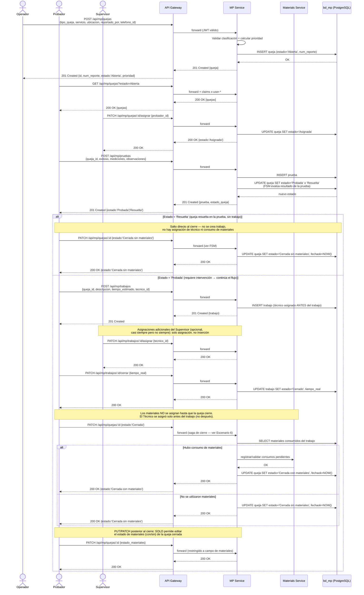
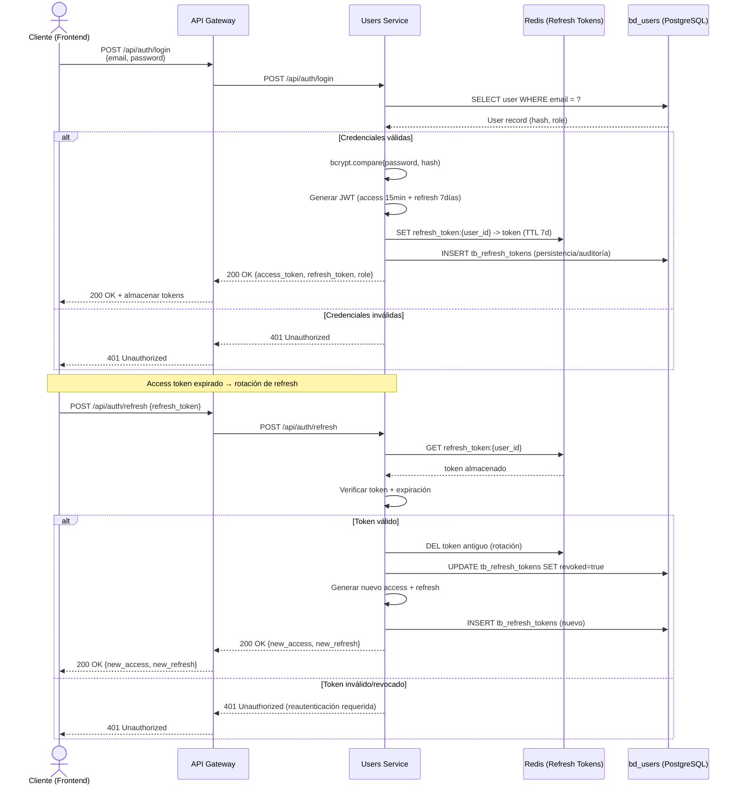
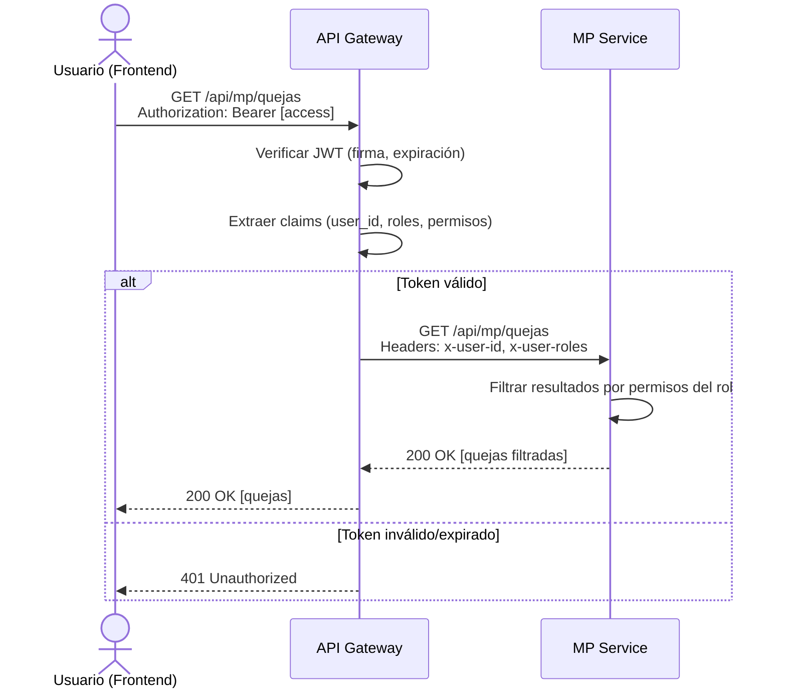
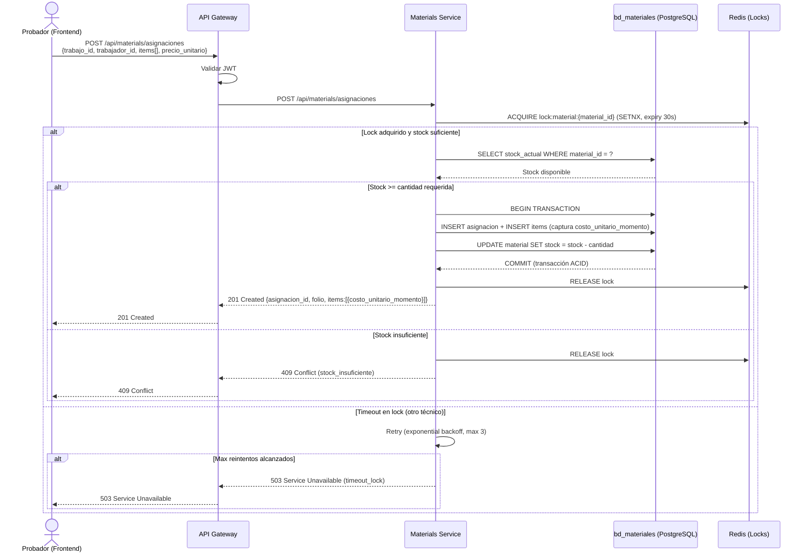
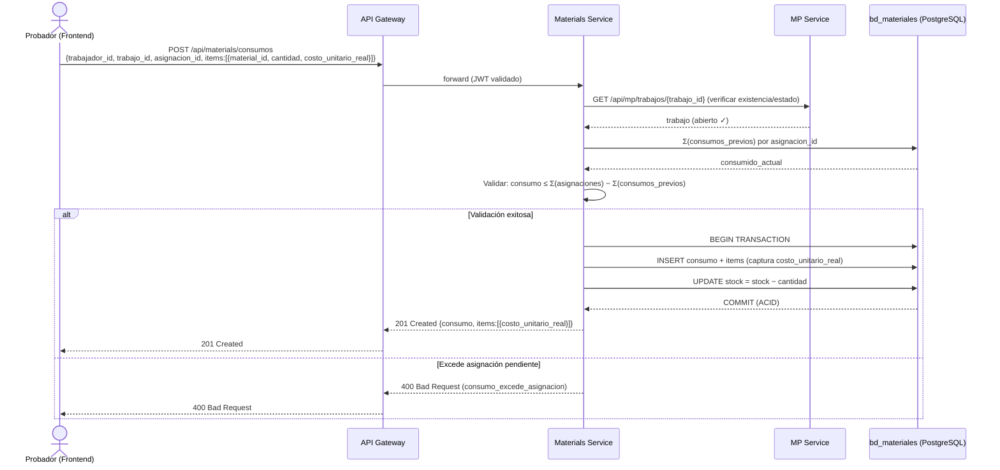
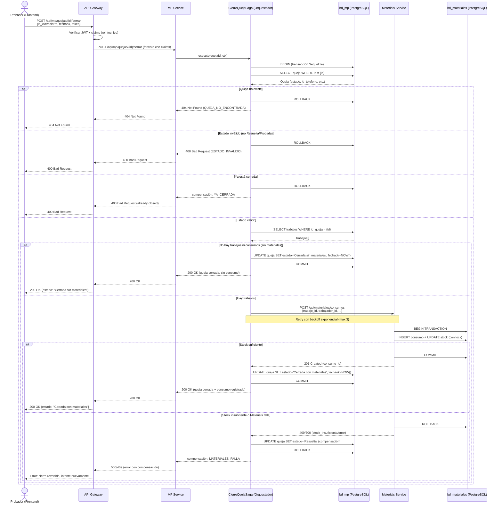
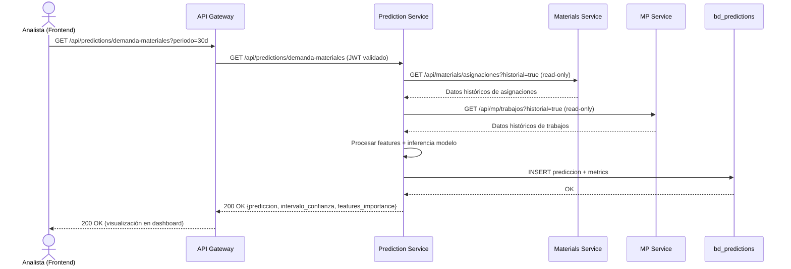

# 📊 Diagramas de Secuencia — SISGAD5

> **Versión:** 2.2 (roles corregidos según dominio real: Probador reemplaza a Operador/Técnico en pruebas y trabajos; Jefe renombrado a Supervisor; nuevos estados `Cerrada con materiales` / `Cerrada sin materiales`)
> **Fecha:** 2026-11-02
> **Tarea:** TASK-100-04
> **Estado:** ✅ Completada
> **Criterio:** escenarios críticos con diagramas Mermaid + tablas de mensajes
> **Fuentes fusionadas:** `docs/diagrams/sequence_diagrams/sequence_diagrams.md` (v. TASK-100-04, 4 escenarios) + `docs/08_sequence_diagrams.es.md` v1.0 (3 escenarios: flujo completo de queja, asignación/consumo de materiales, autenticación con refresh). Los ASCII-art de la v1.0 fueron convertidos a Mermaid; el contenido único de ambas versiones se conservó.

---

## Índice de escenarios

| # | Escenario | Tipo | Origen en fuentes previas |
|---|-----------|------|---------------------------|
| 1 | Flujo completo de queja (Abierta → Cerrada con/sin materiales) | Crítico | 08_es §1 (roles corregidos v2.2) |
| 2 | Login y autenticación JWT con refresh rotativo | Crítico | diag §Esc.1 + 08_es §3 |
| 3 | Acceso a recurso protegido vía Gateway | Crítico | 08_es §3 |
| 4 | Asignación de materiales con validación de stock | Crítico | diag §Esc.2 + 08_es §2 |
| 5 | Consumo de materiales (validación vs asignación) | Crítico | 08_es §2 |
| 6 | Cierre de queja con consumo (saga orquestada) | Crítico | diag §Esc.3 |
| 7 | Predicción de demanda de materiales | Complementario | diag §Esc.4 |

---

## Escenario 1: Flujo completo de queja (Abierta → Cerrada con/sin materiales)

**Roles del dominio (v2.2):** Probador (realiza pruebas, inserta trabajos, cierra el trabajo; el estado `Probada`/`Resuelta` lo devuelve la BD tras registrarse la prueba) · Supervisor (jefe: asigna la queja al probador y realiza las asignaciones de trabajo; **no** inserta trabajos) · Operador (crea la queja). **No existe el rol "Operador" como ejecutor de pruebas.**

**Actores:** Operador, Probador, Supervisor · **Participantes:** API Gateway, MP Service, Materials Service, bd_mp

```mermaid
sequenceDiagram
    actor OP as Operador
    actor PR as Probador
    actor SU as Supervisor
    participant GW as API Gateway
    participant MPS as MP Service
    participant MS as Materials Service
    participant MPDB as bd_mp (PostgreSQL)

    OP->>GW: POST /api/mp/quejas<br/>{tipo_queja, servicio, ubicacion, reportado_por, telefono_id}
    GW->>MPS: forward (JWT válido)
    MPS->>MPS: Validar clasificación + calcular prioridad
    MPS->>MPDB: INSERT queja (estado='Abierta', num_reporte)
    MPDB-->>MPS: OK
    MPS-->>GW: 201 Created {queja}
    GW-->>OP: 201 Created {id, num_reporte, estado:'Abierta', prioridad}

    PR->>GW: GET /api/mp/quejas?estado=Abierta
    GW->>MPS: forward + claims x-user-*
    MPS-->>GW: 200 OK [quejas]
    GW-->>PR: 200 OK [quejas]

    SU->>GW: PATCH /api/mp/quejas/:id/asignar {probador_id}
    GW->>MPS: forward
    MPS->>MPDB: UPDATE queja SET estado='Asignada'
    MPS-->>GW: 200 OK {estado:'Asignada'}
    GW-->>SU: 200 OK

    PR->>GW: POST /api/mp/pruebas<br/>{queja_id, exitoso, mediciones, observaciones}
    GW->>MPS: forward
    MPS->>MPDB: INSERT prueba
    MPS->>MPDB: UPDATE queja SET estado='Probada' o 'Resuelta'<br/>(FSM evalúa resultado de la prueba)
    MPDB-->>MPS: nuevo estado
    MPS-->>GW: 201 Created {prueba, estado_queja}
    GW-->>PR: 201 Created {estado:'Probada'|'Resuelta'}

    alt Estado = 'Resuelta' (queja resuelta en la prueba, sin trabajo)
        Note over PR,MPDB: Salto directo al cierre — no se crea trabajo,<br/>no hay asignación de técnico ni consumo de materiales
        PR->>GW: PATCH /api/mp/quejas/:id {estado:'Cerrada sin materiales'}
        GW->>MPS: forward (ver FSM)
        MPS->>MPDB: UPDATE queja SET estado='Cerrada sin materiales', fechaok=NOW()
        MPS-->>GW: 200 OK
        GW-->>PR: 200 OK {estado:'Cerrada sin materiales'}
    else Estado = 'Probada' (requiere intervención → continúa el flujo)
        PR->>GW: POST /api/mp/trabajos<br/>{queja_id, descripcion, tiempo_estimado, tecnico_id}
        GW->>MPS: forward
        MPS->>MPDB: INSERT trabajo (técnico asignado ANTES del trabajo)
        MPS-->>GW: 201 Created {trabajo}
        GW-->>PR: 201 Created

        Note over SU,MPS: Asignaciones adicionales del Supervisor (opcional,<br/>casi siempre pero no siempre): solo asignación, no inserción
        SU->>GW: PATCH /api/mp/trabajos/:id/asignar {tecnico_id}
        GW->>MPS: forward
        MPS-->>GW: 200 OK
        GW-->>SU: 200 OK

        PR->>GW: PATCH /api/mp/trabajos/:id/cerrar {tiempo_real}
        GW->>MPS: forward
        MPS->>MPDB: UPDATE trabajo SET estado='Cerrado', tiempo_real
        MPS-->>GW: 200 OK
        GW-->>PR: 200 OK

        Note over PR,MS: Los materiales NO se asignan hasta que la queja cierre.<br/>El Técnico se asignó solo antes del trabajo (no después).
        PR->>GW: PATCH /api/mp/quejas/:id {estado:'Cerrada'}
        GW->>MPS: forward (saga de cierre — ver Escenario 6)
        MPS->>MPDB: SELECT materiales consumidos del trabajo
        alt Hubo consumo de materiales
            MPS->>MS: registrar/validar consumos pendientes
            MS-->>MPS: OK
            MPS->>MPDB: UPDATE queja SET estado='Cerrada con materiales', fechaok=NOW()
            MPS-->>GW: 200 OK
            GW-->>PR: 200 OK {estado:'Cerrada con materiales'}
        else No se utilizaron materiales
            MPS->>MPDB: UPDATE queja SET estado='Cerrada sin materiales', fechaok=NOW()
            MPS-->>GW: 200 OK
            GW-->>PR: 200 OK {estado:'Cerrada sin materiales'}
        end

        Note over PR,MPS: PUT/PATCH posterior al cierre: SOLO permite editar<br/>el estado de materiales (con/sin) de la queja cerrada
        PR->>GW: PATCH /api/mp/quejas/:id {estado_materiales}
        GW->>MPS: forward (restringido a campo de materiales)
        MPS-->>GW: 200 OK
        GW-->>PR: 200 OK
    end
```

### Tabla de Mensajes — Flujo Completo de Queja (roles v2.2)

| # | De | Hacia | Mensaje | Datos |
|---|----|-------|---------|-------|
| 1 | Operador | Sistema | `POST /api/mp/quejas` | {tipo_queja, servicio, ubicacion, reportado_por, telefono_id} |
| 2 | Sistema | Operador | 201 Created | {queja: {id, num_reporte, estado: "Abierta", prioridad}} |
| 3 | Probador | Sistema | `GET /api/mp/quejas?estado=Abierta` | - |
| 4 | Supervisor | Sistema | `PATCH /api/mp/quejas/:id/asignar` | {probador_id} — solo asignaciones |
| 5 | Sistema | - | 200 OK | {queja: {estado: "Asignada"}} |
| 6 | Probador | Sistema | `POST /api/mp/pruebas` | {queja_id, exitoso, mediciones, observaciones} |
| 7 | Sistema (BD vía FSM) | Probador | 201 Created | {prueba, estado_queja: "Probada" \| "Resuelta"} — la BD devuelve el estado tras la prueba |
| 8a | Probador | Sistema | `PATCH /api/mp/quejas/:id` (rama Resuelta) | {estado: "Cerrada sin materiales"} — cierre directo, sin trabajo |
| 8b | Probador | Sistema | `POST /api/mp/trabajos` (rama Probada) | {queja_id, descripcion, tiempo_estimado, tecnico_id} — el probador inserta el trabajo; el técnico se asigna aquí, antes del trabajo |
| 9 | Supervisor | Sistema | `PATCH /api/mp/trabajos/:id/asignar` | {tecnico_id} — asignación opcional/adicional (casi siempre, no siempre) |
| 10 | Probador | Sistema | `PATCH /api/mp/trabajos/:id/cerrar` | {tiempo_real} |
| 11 | Probador | Sistema | `PATCH /api/mp/quejas/:id` (cierre) | {estado: "Cerrada"} → saga deriva a "Cerrada con materiales" o "Cerrada sin materiales" según consumos |
| 12 | Sistema | Probador | 200 OK | {queja: {estado: "Cerrada con materiales" \| "Cerrada sin materiales", fechaok}} |
| 13 | Probador | Sistema | `PATCH /api/mp/quejas/:id` (post-cierre) | Solo edición del estado de materiales de la queja cerrada |

> **Reglas de dominio (v2.2):**
> 1. **No existe el rol "Operador" ejecutando pruebas** — quien prueba es el **Probador**.
> 2. El **Supervisor** (antes documentado como "Jefe") es el jefe inscrito: **solo realiza asignaciones**, nunca inserta trabajos.
> 3. El **Probador inserta el trabajo** (`POST /trabajos`) y se ejecuta casi siempre, salvo cuando la prueba resuelve la queja directamente (estado `Resuelta` → cierre sin trabajo).
> 4. El estado `Probada`/`Resuelta` **lo devuelve la BD** tras registrarse la prueba (FSM), antes de cualquier asignación.
> 5. **El técnico se asigna solo antes del trabajo** (en la creación o por el Supervisor); la asignación de técnico *después* del trabajo queda eliminada del flujo.
> 6. **Los materiales no se asignan hasta que la queja cierre**; al cerrar, la queja queda en `Cerrada con materiales` (hubo consumo) o `Cerrada sin materiales` (no hubo consumo).
> 7. `PUT`/`PATCH` posteriores al cierre sirven **únicamente** para editar el estado de consumo de materiales de la queja cerrada.
> 8. **Nota:** el cierre real con trabajos asociados se ejecuta como saga orquestada con compensación — ver **Escenario 6**.

---

## Escenario 2: Login y Autenticación con JWT (+ Refresh Rotativo)

**Actores:** Cliente (Frontend) · **Participantes:** API Gateway, Users Service, Redis, bd_users

```mermaid
sequenceDiagram
    actor C as Cliente (Frontend)
    participant GW as API Gateway
    participant US as Users Service
    participant RDB as Redis (Refresh Tokens)
    participant UBD as bd_users (PostgreSQL)

    C->>GW: POST /api/auth/login<br/>{email, password}
    GW->>US: POST /api/auth/login
    US->>UBD: SELECT user WHERE email = ?
    UBD-->>US: User record (hash, role)
    alt Credenciales válidas
        US->>US: bcrypt.compare(password, hash)
        US->>US: Generar JWT (access 15min + refresh 7días)
        US->>RDB: SET refresh_token:{user_id} -> token (TTL 7d)
        US->>UBD: INSERT tb_refresh_tokens (persistencia/auditoría)
        US-->>GW: 200 OK {access_token, refresh_token, role}
        GW-->>C: 200 OK + almacenar tokens
    else Credenciales inválidas
        US-->>GW: 401 Unauthorized
        GW-->>C: 401 Unauthorized
    end

    Note over C,US: Access token expirado → rotación de refresh
    C->>GW: POST /api/auth/refresh {refresh_token}
    GW->>US: POST /api/auth/refresh
    US->>RDB: GET refresh_token:{user_id}
    RDB-->>US: token almacenado
    US->>US: Verificar token + expiración
    alt Token válido
        US->>RDB: DEL token antiguo (rotación)
        US->>UBD: UPDATE tb_refresh_tokens SET revoked=true
        US->>US: Generar nuevo access + refresh
        US->>UBD: INSERT tb_refresh_tokens (nuevo)
        US-->>GW: 200 OK {new_access, new_refresh}
        GW-->>C: 200 OK {new_access, new_refresh}
    else Token inválido/revocado
        US-->>GW: 401 Unauthorized (reautenticación requerida)
        GW-->>C: 401 Unauthorized
    end
```

### Tabla de Mensajes — Login y Autenticación

| Paso | Emisor | Mensaje | Destino | Protocolo | Descripción |
| ---- | ------ | ------- | ------- | --------- | ----------- |
| 1 | Cliente (Frontend) | `POST /api/auth/login` | API Gateway | HTTPS | Envío de credenciales (email + password) |
| 2 | API Gateway | `POST /api/auth/login` | Users Service | REST/JSON | Reenvío de credenciales al servicio |
| 3 | Users Service | `SELECT * FROM usuarios WHERE email = ?` | bd_users | SQL | Búsqueda de usuario por email |
| 4 | bd_users | User record (con hash de password y role) | Users Service | SQL | Respuesta con datos del usuario |
| 5 | Users Service | `bcrypt.compare(password, hash)` | — | Internal | Validación de contraseña |
| 6 | Users Service | `JWT.sign({id, role, exp})` | — | Internal | Generación del access token (15 min) |
| 7 | Users Service | `JWT.sign({id, exp})` | — | Internal | Generación del refresh token (7 días) |
| 8 | Users Service | `SET refresh:{user_id} → token (TTL 7d)` | Redis | Redis | Almacenamiento del refresh token |
| 9 | Users Service | `INSERT tb_refresh_tokens` | bd_users | SQL | Persistencia para auditoría/revocación |
| 10 | Users Service | `200 OK {access, refresh, role}` | API Gateway | REST/JSON | Respuesta con tokens |
| 11 | API Gateway | `200 OK {access, refresh, role}` | Cliente | HTTPS | Respuesta al frontend |
| 12 | Cliente (Frontend) | `POST /api/auth/refresh` {refresh_token} | API Gateway | HTTPS | Renovación tras expiración del access |
| 13 | Users Service | Verificar refresh en Redis/BD, rotar | — | Internal | DELETE old + INSERT new (revoked=true anterior) |
| 14 | Users Service | `200 OK {new_access, new_refresh}` | API Gateway | REST/JSON | Nuevos tokens |
| 15 | API Gateway | `200 OK {new_access, new_refresh}` | Cliente | HTTPS | Respuesta al frontend |

---

## Escenario 3: Acceso a Recurso Protegido (Claims vía Gateway)

**Actores:** Usuario · **Participantes:** API Gateway, MP Service

```mermaid
sequenceDiagram
    actor U as Usuario (Frontend)
    participant GW as API Gateway
    participant MPS as MP Service

    U->>GW: GET /api/mp/quejas<br/>Authorization: Bearer [access]
    GW->>GW: Verificar JWT (firma, expiración)
    GW->>GW: Extraer claims (user_id, roles, permisos)
    alt Token válido
        GW->>MPS: GET /api/mp/quejas<br/>Headers: x-user-id, x-user-roles
        MPS->>MPS: Filtrar resultados por permisos del rol
        MPS-->>GW: 200 OK [quejas filtradas]
        GW-->>U: 200 OK [quejas]
    else Token inválido/expirado
        GW-->>U: 401 Unauthorized
    end
```

### Tabla de Mensajes — Acceso a Recurso Protegido

| # | De | Hacia | Mensaje | Datos |
|---|----|-------|---------|-------|
| 1 | Usuario | Gateway | `GET /api/mp/quejas` | Header: Authorization: Bearer \<access\> |
| 2 | Gateway | - | Verificar JWT (firma, expiración) | - |
| 3 | Gateway | - | Extraer claims (user_id, roles) | - |
| 4 | Gateway | MP | `GET /api/mp/quejas` | Headers: X-User-Id, X-User-Roles |
| 5 | MP | Gateway | 200 OK | [quejas filtradas por permisos] |
| 6 | Gateway | Usuario | 200 OK | [quejas] |

---

## Escenario 4: Asignación de Materiales con Validación de Stock

**Actores:** Probador (Frontend) — la asignación de materiales ocurre al cierre de la queja (v2.2) · **Participantes:** API Gateway, Materials Service, Redis (Locks), bd_materiales

```mermaid
sequenceDiagram
    actor T as Probador (Frontend)
    participant GW as API Gateway
    participant MS as Materials Service
    participant MADB as bd_materiales (PostgreSQL)
    participant RDX as Redis (Locks)

    T->>GW: POST /api/materials/asignaciones<br/>{trabajo_id, trabajador_id, items[], precio_unitario}
    GW->>GW: Validar JWT
    GW->>MS: POST /api/materials/asignaciones
    MS->>RDX: ACQUIRE lock:material:{material_id} (SETNX, expiry 30s)
    alt Lock adquirido y stock suficiente
        MS->>MADB: SELECT stock_actual WHERE material_id = ?
        MADB-->>MS: Stock disponible
        alt Stock >= cantidad requerida
            MS->>MADB: BEGIN TRANSACTION
            MS->>MADB: INSERT asignacion + INSERT items (captura costo_unitario_momento)
            MS->>MADB: UPDATE material SET stock = stock - cantidad
            MADB-->>MS: COMMIT (transacción ACID)
            MS->>RDX: RELEASE lock
            MS-->>GW: 201 Created {asignacion_id, folio, items:[{costo_unitario_momento}]}
            GW-->>T: 201 Created
        else Stock insuficiente
            MS->>RDX: RELEASE lock
            MS-->>GW: 409 Conflict (stock_insuficiente)
            GW-->>T: 409 Conflict
        end
    else Timeout en lock (otro técnico)
        MS->>MS: Retry (exponential backoff, max 3)
        alt Max reintentos alcanzados
            MS-->>GW: 503 Service Unavailable (timeout_lock)
            GW-->>T: 503 Service Unavailable
        end
    end
```

### Tabla de Mensajes — Asignación de Materiales

| Paso | Emisor | Mensaje | Destino | Protocolo | Descripción |
| ---- | ------ | ------- | ------- | --------- | ----------- |
| 1 | Probador (Frontend) | `POST /api/materials/asignaciones` | API Gateway | HTTPS | Solicitud de asignación (múltiples ítems) |
| 2 | API Gateway | Verificar JWT | — | Internal | Validación de autenticación |
| 3 | API Gateway | `POST /api/materials/asignaciones` | Materials Service | REST/JSON | Reenvío de la solicitud |
| 4 | Materials Service | `SETNX lock:material:{id} (expiry 30s)` | Redis | Redis | Adquisición de distributed lock |
| 5 | Redis | `OK` o `EXISTS` | Materials Service | Redis | Respuesta de lock |
| 6 | Materials Service | `SELECT stock_actual WHERE id = ?` | bd_materiales | SQL | Consulta de stock disponible |
| 7 | bd_materiales | Stock disponible | Materials Service | SQL | Respuesta con cantidad en stock |
| 8 | Materials Service | `BEGIN TRANSACTION` | bd_materiales | SQL | Inicio de transacción |
| 9 | Materials Service | `INSERT INTO asignaciones` + `INSERT INTO items` | bd_materiales | SQL | Creación de registro (captura `costo_unitario_momento`) |
| 10 | Materials Service | `UPDATE material SET stock = stock - n` | bd_materiales | SQL | Decremento de stock |
| 11 | bd_materiales | `COMMIT` | Materials Service | SQL | Confirmación atómica de la transacción |
| 12 | Materials Service | `DEL lock:material:{id}` | Redis | Redis | Liberación del lock |
| 13 | Materials Service | `201 Created {asignacion_id, folio}` | API Gateway | REST/JSON | Confirmación de asignación creada |
| 14 | API Gateway | `201 Created` | Probador | HTTPS | Respuesta al frontend |
| 15 | Materials Service | `409 Conflict` (stock_insuficiente) | API Gateway | REST/JSON | Error: stock insuficiente |
| 16 | Materials Service | Retry con backoff exponencial (max 3 intentos) | — | Internal | Reintento por lock ocupado |

---

## Escenario 5: Consumo de Materiales (Validación vs Asignación)

**Actores:** Probador · **Participantes:** API Gateway, Materials Service, MP Service, bd_materiales

```mermaid
sequenceDiagram
    actor T as Probador (Frontend)
    participant GW as API Gateway
    participant MS as Materials Service
    participant MPS as MP Service
    participant MADB as bd_materiales (PostgreSQL)

    T->>GW: POST /api/materials/consumos<br/>{trabajador_id, trabajo_id, asignacion_id, items:[{material_id, cantidad, costo_unitario_real}]}
    GW->>MS: forward (JWT validado)
    MS->>MPS: GET /api/mp/trabajos/{trabajo_id} (verificar existencia/estado)
    MPS-->>MS: trabajo (abierto ✓)
    MS->>MADB: Σ(consumos_previos) por asignacion_id
    MADB-->>MS: consumido_actual
    MS->>MS: Validar: consumo ≤ Σ(asignaciones) − Σ(consumos_previos)
    alt Validación exitosa
        MS->>MADB: BEGIN TRANSACTION
        MS->>MADB: INSERT consumo + items (captura costo_unitario_real)
        MS->>MADB: UPDATE stock = stock − cantidad
        MADB-->>MS: COMMIT (ACID)
        MS-->>GW: 201 Created {consumo, items:[{costo_unitario_real}]}
        GW-->>T: 201 Created
    else Excede asignación pendiente
        MS-->>GW: 400 Bad Request (consumo_excede_asignacion)
        GW-->>T: 400 Bad Request
    end
```

### Tabla de Mensajes — Consumo de Materiales

| # | De | Hacia | Mensaje | Datos |
|---|----|-------|---------|-------|
| 1 | Probador | Sistema | `POST /api/materials/consumos` | {trabajador_id, trabajo_id, asignacion_id, items: [...]} |
| 2 | Sistema | - | Verificar trabajo existente/abierto | `GET /api/mp/trabajos/{id}` |
| 3 | Sistema | - | Validar consumo ≤ asignación pendiente | Σ(consumos) ≤ Σ(asignaciones) − Σ(consumos_previos) |
| 4 | Sistema | - | Transacción: INSERT consumo + items | db.Transaction() |
| 5 | Sistema | - | Capturar costo_unitario_real | Input del probador |
| 6 | Sistema | Probador | 201 Created | {consumo, items: [{costo_unitario_real}]} |

---

## Escenario 6: Cierre de Queja con Consumo de Materiales (Saga Orquestada)

**Actores:** Probador (Frontend) · **Participantes:** API Gateway, MP Service, CierreQuejaSaga, bd_mp, Materials Service, bd_materiales

```mermaid
sequenceDiagram
    actor PRb as Probador (Frontend)
    participant GW as API Gateway
    participant MPS as MP Service
    participant SAGA as CierreQuejaSaga (Orquestador)
    participant MPDB as bd_mp (PostgreSQL)
    participant MS as Materials Service
    participant MADB as bd_materiales (PostgreSQL)

    PRb->>GW: POST /api/mp/quejas/{id}/cerrar<br/>{id_clavecierre, fechaok, token}
    GW->>GW: Verificar JWT + claims (rol: tecnico)
    GW->>MPS: POST /api/mp/quejas/{id}/cerrar (forward con claims)
    MPS->>SAGA: execute(quejaId, ctx)

    SAGA->>MPDB: BEGIN (transacción Sequelize)
    SAGA->>MPDB: SELECT queja WHERE id = {id}
    MPDB-->>SAGA: Queja (estado, id_telefono, etc.)

    alt Queja no existe
        SAGA->>MPDB: ROLLBACK
        SAGA-->>MPS: 404 Not Found (QUEJA_NO_ENCONTRADA)
        MPS-->>GW: 404 Not Found
        GW-->>PRb: 404 Not Found
    else Estado inválido (no Resuelta/Probada)
        SAGA->>MPDB: ROLLBACK
        SAGA-->>MPS: 400 Bad Request (ESTADO_INVALIDO)
        MPS-->>GW: 400 Bad Request
        GW-->>PRb: 400 Bad Request
    else Ya está cerrada
        SAGA->>MPDB: ROLLBACK
        SAGA-->>MPS: compensación: YA_CERRADA
        MPS-->>GW: 400 Bad Request (already closed)
        GW-->>PRb: 400 Bad Request
    else Estado válido
        SAGA->>MPDB: SELECT trabajos WHERE id_queja = {id}
        MPDB-->>SAGA: trabajos[]
        alt No hay trabajos ni consumos (sin materiales)
            SAGA->>MPDB: UPDATE queja SET estado='Cerrada sin materiales', fechaok=NOW()
            SAGA->>MPDB: COMMIT
            SAGA-->>MPS: 200 OK (queja cerrada, sin consumo)
            MPS-->>GW: 200 OK
            GW-->>PRb: 200 OK {estado: "Cerrada sin materiales"}
        else Hay trabajos
            SAGA->>MS: POST /api/materiales/consumos<br/>{trabajo_id, trabajador_id, ...}
            Note over SAGA,MS: Retry con backoff exponencial (max 3)
            MS->>MADB: BEGIN TRANSACTION
            MS->>MADB: INSERT consumo + UPDATE stock (con lock)
            alt Stock suficiente
                MS->>MADB: COMMIT
                MS-->>SAGA: 201 Created {consumo_id}
                SAGA->>MPDB: UPDATE queja SET estado='Cerrada con materiales', fechaok=NOW()
                SAGA->>MPDB: COMMIT
                SAGA-->>MPS: 200 OK (queja cerrada + consumo registrado)
                MPS-->>GW: 200 OK
                GW-->>PRb: 200 OK {estado: "Cerrada con materiales"}
            else Stock insuficiente o Materials falla
                MS->>MADB: ROLLBACK
                MS-->>SAGA: 409/500 (stock_insuficiente/error)
                SAGA->>MPDB: UPDATE queja SET estado='Resuelta' (compensación)
                SAGA->>MPDB: ROLLBACK
                SAGA-->>MPS: compensación: MATERIALES_FALLA
                MPS-->>GW: 500/409 (error con compensación)
                GW-->>PRb: Error: cierre revertido, intente nuevamente
            end
        end
    end
```

### Tabla de Mensajes — Cierre de Queja (Saga Orquestada)

| Paso | Emisor | Mensaje | Destino | Protocolo | Descripción |
| ---- | ------ | ------- | ------- | --------- | ----------- |
| 1 | Probador (Frontend) | `POST /api/mp/quejas/{id}/cerrar` | API Gateway | HTTPS | Cierre de queja con datos de cierre |
| 2 | API Gateway | Verificar JWT + claims (`rol: probador`) | — | Internal | Validación con claims (no llama a Users Service) |
| 3 | API Gateway | Forward request con headers `x-user-*` | MP Service | REST/JSON | Propagación de claims |
| 4 | MP Service | `CierreQuejaSaga.execute(quejaId, ctx)` | — | Internal | Inicio de orquestación |
| 5 | CierreQuejaSaga | `BEGIN` | bd_mp | SQL | Transacción local |
| 6 | CierreQuejaSaga | `SELECT queja WHERE id = ?` | bd_mp | SQL | Validar existencia y estado |
| 7 | CierreQuejaSaga | Validar FSM: estado ∈ {Resuelta, Probada} | — | Internal | Verificación de máquina de estados |
| 8 | CierreQuejaSaga | (difiere v2.2: el estado final se fija tras evaluar consumos) | — | Internal | Cierre local pendiente de clasificación con/sin materiales |
| 9 | CierreQuejaSaga | `SELECT trabajos WHERE id_queja = ?` | bd_mp | SQL | Buscar trabajos asociados |
| 10 | CierreQuejaSaga | `POST /api/materiales/consumos` | Materials Service | REST/JSON | Registro de consumo (si hay trabajos) |
| 11 | Materials Service | `BEGIN TRANSACTION` + `INSERT consumo` + `UPDATE stock` | bd_materiales | SQL | Transacción ACID remota |
| 12 | CierreQuejaSaga | `UPDATE quejas SET estado='Cerrada con/sin materiales'` + `COMMIT` | bd_mp | SQL | Estado final según consumos + confirmación local |
| 13 | CierreQuejaSaga | `UPDATE quejas SET estado='Resuelta'` (rollback) | bd_mp | SQL | Compensación (si Materials falla) |
| 14 | CierreQuejaSaga | `ROLLBACK` | bd_mp | SQL | Reversión de transacción local |

---

## Escenario 7: Predicción de Demanda de Materiales (Complementario)

**Actores:** Analista · **Participantes:** API Gateway, Prediction Service, Materials Service, MP Service, bd_predictions

```mermaid
sequenceDiagram
    actor A as Analista (Frontend)
    participant GW as API Gateway
    participant PRED as Prediction Service
    participant MS as Materials Service
    participant MPS as MP Service
    participant PDB as bd_predictions

    A->>GW: GET /api/predictions/demanda-materiales?periodo=30d
    GW->>PRED: GET /api/predictions/demanda-materiales (JWT validado)
    PRED->>MS: GET /api/materials/asignaciones?historial=true (read-only)
    MS-->>PRED: Datos históricos de asignaciones
    PRED->>MPS: GET /api/mp/trabajos?historial=true (read-only)
    MPS-->>PRED: Datos históricos de trabajos
    PRED->>PRED: Procesar features + inferencia modelo
    PRED->>PDB: INSERT prediccion + metrics
    PDB-->>PRED: OK
    PRED-->>GW: 200 OK {prediccion, intervalo_confianza, features_importance}
    GW-->>A: 200 OK (visualización en dashboard)
```

---

## Referencias

- [Casos de Uso](../../03_use_cases.es.md)
- [Modelo de Dominio](../../07_domain_model.es.md)
- [Máquinas de Estado](../../09_state_machines.es.md)
- [Estrategia de Seguridad](../../13_security.es.md)

---

## Registro de Cambios

### v2.2 — 2026-11-02 (corrección de roles y estados según dominio real)
Correcciones aplicadas tras revisión del propietario (pendiente propagar a `docs/07_domain_model.es.md` y demás documentos cuando la revisión archivo-por-archivo llegue a cada uno):

1. **Roles:** se eliminó el rol inexistente "Operador como ejecutor de pruebas" → es el **Probador** quien realiza pruebas, cierra trabajos e **inserta los trabajos**. El rol "Jefe" fue renombrado a **Supervisor** (jefe inscrito; solo realiza asignaciones, nunca inserta trabajos). El Operador únicamente crea la queja.
2. **Orden del flujo:** la asignación de la queja al probador ocurre ANTES de la prueba; el estado `Probada`/`Resuelta` lo devuelve la BD (FSM) tras registrarse la prueba. Si `Resuelta` → cierre directo sin trabajo; si `Probada` → continúa con trabajo.
3. **Eliminada** la asignación de técnico *después* del trabajo: el técnico se asigna solo antes (en la creación del trabajo por el probador o adicionalmente por el supervisor).
4. **Nuevos estados de cierre:** `Cerrada con materiales` / `Cerrada sin materiales`. Los materiales no se asignan hasta que la queja cierre; la saga (Escenario 6) fija el estado final según existan consumos.
5. **Restricción post-cierre:** `PUT/PATCH` sobre queja cerrada solo permite editar el estado de consumo de materiales.
6. Escenarios 4, 5 y 6 actualizados con los roles correctos (Probador en lugar de Técnico/Analista; claim `rol: probador`).
7. Sintaxis Mermaid revalidada con @mermaid-js/mermaid-cli v11: los 7 bloques renderizan sin errores.
