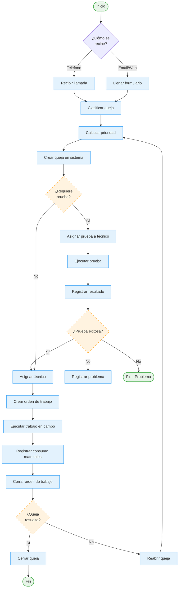
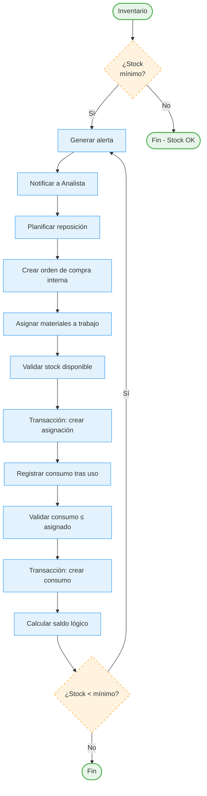
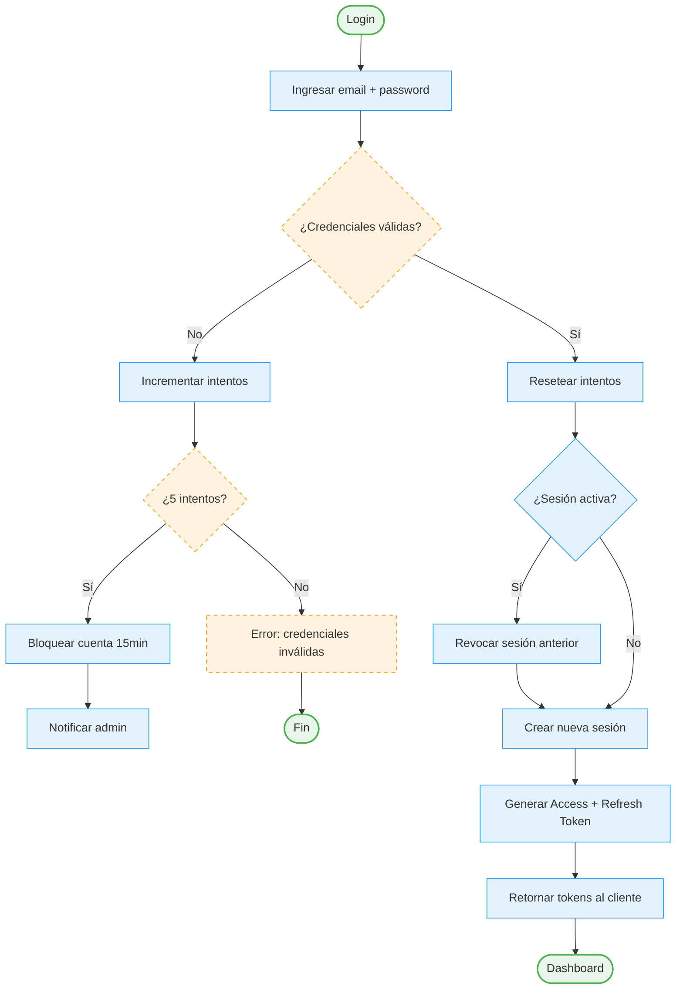

# Práctica 04 - BPMN (Modelado de Procesos de Negocio)

> **Disciplina:** Ingeniería de Negocio  
> **Especialidad:** Business Process Model and Notation  
> **Objetivo:** Modelar los procesos clave de SISGAD5

---

## 1. Proceso 1: Gestión de Quejas (Proceso Principal)

### Descripción
Este es el proceso principal del sistema: desde la recepción de una queja hasta su cierre.

### Diagrama BPMN

### Tabla de Procesos (Pooled Tasks)

| Pool | Lane | Actividad | Descripción |
|------|------|-----------|-------------|
| **Clientes** | Cliente Final | Reportar incidencia | Llamar o llenar formulario web |
| **Operaciones** | Operador | Clasificar queja | Asignar tipo, servicio, ubicación, clave |
| **Operaciones** | Sistema | Priorizar | Calcular prioridad (1-4) basada en reglas |
| **Campo** | Técnico | Ejecutar prueba | Medir y documentar en sitio |
| **Campo** | Técnico | Ejecutar trabajo | Reparar o instalar en sitio |
| **Logística** | Analista | Asignar materiales | Crear asignación, validar stock |
| **Logística** | Sistema | Registrar consumo | Descontar materiales usados |
| **Supervisión** | Jefe | Asignar técnico | Designar responsable |
| **Supervisión** | Jefe | Cerrar queja | Verificar y cerrar |

### Eventos de Proceso

| Evento | Tipo | Disparador |
|--------|------|------------|
| Queja Reportada | Start (Message) | Recepción de queja |
| Prueba Completada | Intermediate (Message) | Registro de prueba |
| Trabajo Cerrado | Intermediate (Message) | Cierre de orden |
| Queja Cerrada | End (Message) | Cierre definitivo |
| Queja Reabierta | Intermediate (Message) | Requiere revisión |
| Stock Bajo | Intermediate (Timer/Message) | Verificación periódica |

---

## 2. Proceso 2: Gestión de Materiales

### Diagrama BPMN

---

## 3. Proceso 3: Autenticación y Autorización

### Diagrama BPMN

---

## 4. Términos BPMN Utilizados

| Elemento | Uso en SISGAD5 |
|----------|----------------|
| **Pool** | Separación por rol/área (Clientes, Operaciones, Campo, Logística, Supervisión, Sistema) |
| **Lane** | Sub-división dentro de pool (Operador vs Sistema) |
| **Task (Actividad)** | Acciones discretas (Clasificar, Priorizar, Crear, Asignar) |
| **Subprocess** | Agrupación de tareas complejas (Transacción Materiales) |
| **Gateway (Exclusive)** | Decisiones (¿Requiere prueba?, ¿Stock bajo?, ¿Credenciales válidas?) |
| **Event Start (Message)** | Eventos externos (Queja Reportada, Login) |
| **Event Intermediate (Timer)** | Verificaciones periódicas (alertas de stock) |
| **Event End** | Resultados del proceso (Queja Cerrada, Login Exitoso) |
| **Sequence Flow** | Flujo de trabajo y datos |
| **Data Object** | Información compartida (queja, material, tokens) |
| **Annotation** | Reglas de negocio asociadas |

---

## 5. Métricas de Procesos (KPIs)

| Proceso | KPI | Objetivo |
|---------|-----|----------|
| Quejas | Tiempo de cierre (Abierta→Cerrada) | < 48 horas |
| Quejas | Tiempo desde reporte → primera prueba | < 4 horas |
| Materiales | Tiempo desde alerta stock → reposición | < 24 horas |
| Autenticación | Tasa de logins fallidos | < 5% |
| Trabajos | Tiempo estimado vs real (desviación) | < ±20% |

---

## 6. Referencias

- [User Story Map](practice_02_user_story_map.md)
- [Reglas de Negocio](../06_business_rules.md)
- [Casos de Uso](../03_use_cases.md)
- [Máquinas de Estado](../09_state_machines.md)
- [Event Storming](practice_03_event_storming.md)