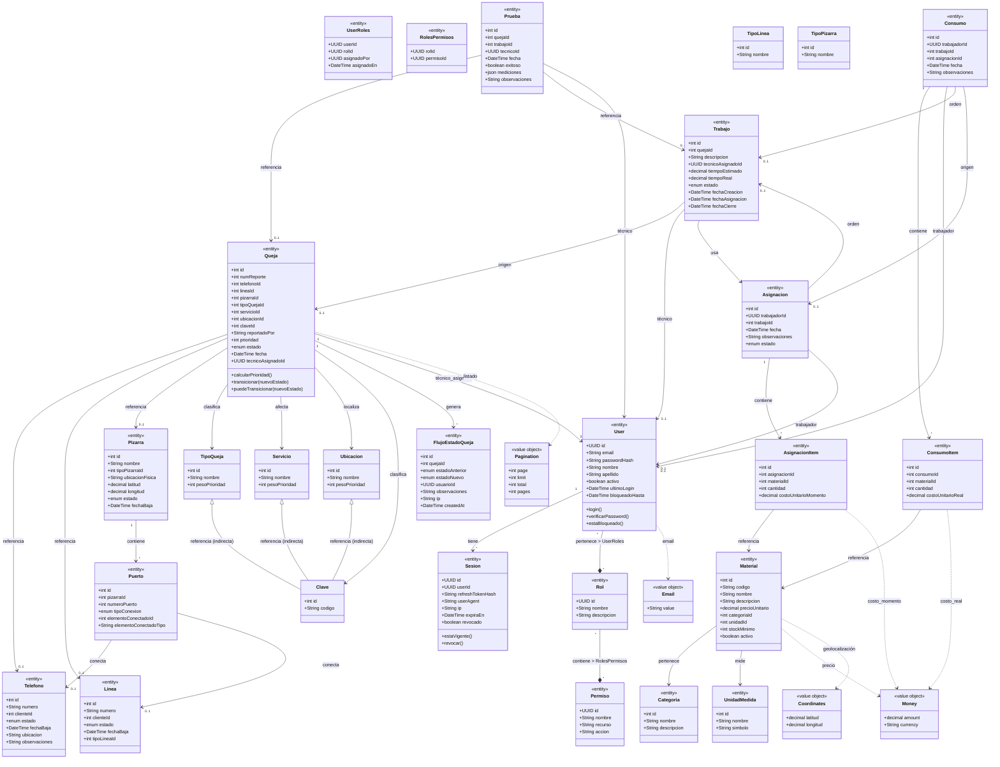
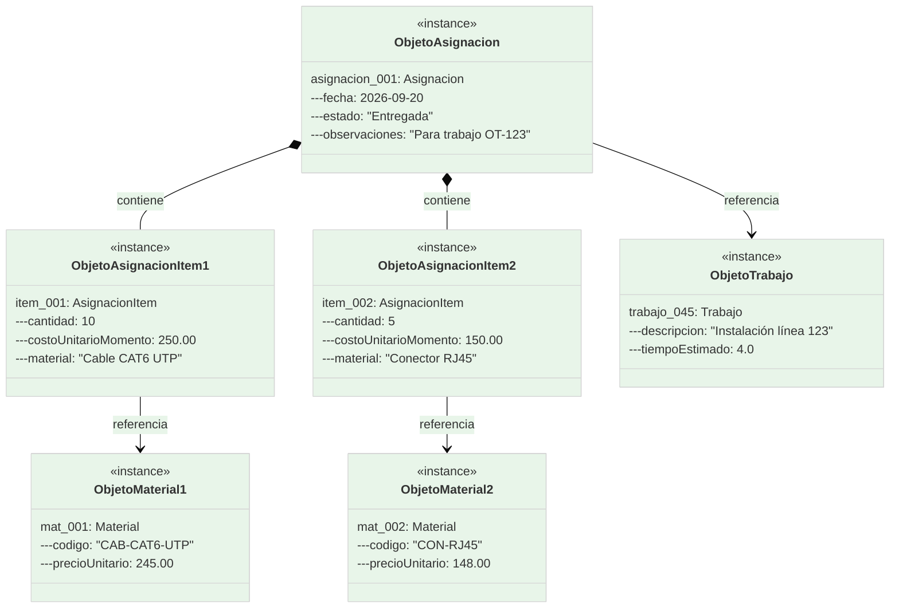
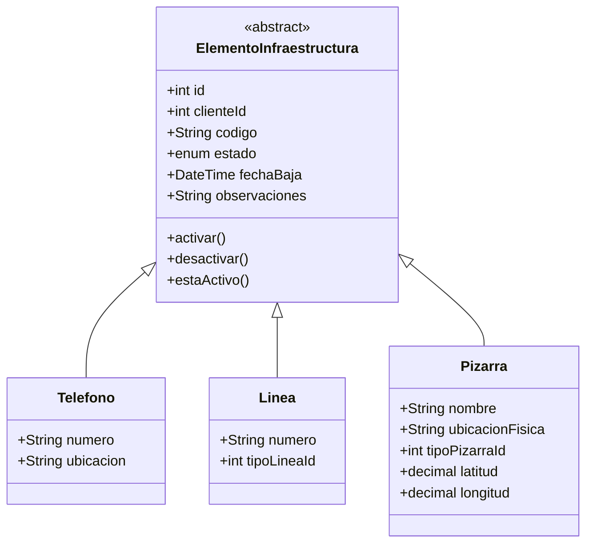
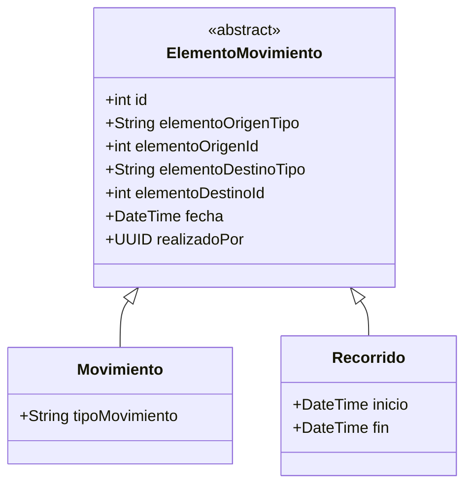

# Práctica 05 - UML Estático (Diagramas de Clases y Objeto)

> **Disciplina:** Ingeniería de Software  
> **Especialidad:** UML (Unified Modeling Language) - Vista Estática  
> **Basado en:** [SISGAD5_doc/docs/03-07](https://github.com/ybotet/SISGAD5_doc)

---

## 1. Diagrama de Clases (28 clases)

### 28 Clases Principales



### Leyenda

| Símbolo | Significado |
|---------|-------------|
| `<<entity>>` | Entidad con identidad única (PK) |
| `<<value object>>` | Valor sin identidad, inmutable |
| `<<context>>` | Contexto delimitado (Bounded Context) |
| 1..* | Uno a Muchos |
| 0..1 | Opcional (cero o uno) |
| *..* | Muchos a Muchos (con tabla pivot) |
| --> | Herencia/Agregación |
| --| | Composición |

---

## 2. Contextos Delimitados (5 Ctx)

```mermaid
%%{init: {'theme': 'base', 'themeVariables': { 'primaryColor': '#e3f2fd', 'secondaryColor': '#e8f5e9', 'tertiaryColor': '#fff3e0', 'lineColor': '#666' }}}%%
classDiagram
    class AuthContext {
        <<Context>>
        User, Sesion, Rol, Permiso
        UserRoles, RolesPermisos
    }
    
    class UsersContext {
        <<Context>>
        User (extendida desde Auth)
        UserProfile, BlacklistedToken
    }
    
    class MPContext {
        <<Context>>
        Telefono, Linea, Pizarra, Puerto
        Queja, FlujoEstadoQueja
        Prueba, Trabajo
        Catálogos: TipoQueja, Servicio, etc.
    }
    
    class MaterialsContext {
        <<Context>>
        Material, Categoria, UnidadMedida
        Asignacion, AsignacionItem
        Consumo, ConsumoItem
    }
    
    class SharedKernel {
        <<Context>>
        Money, Pagination, Coordinates, Email, UUID, DateTime
    }
    
    AuthContext --|> SharedKernel
    UsersContext --|> SharedKernel
    MPContext --|> SharedKernel
    MaterialsContext --|> SharedKernel
    
    note right of AuthContext
        Responsabilidades:\n- Autenticación\n- Sesiones\n- Roles & Permisos
    end note
    
    note right of MPContext
        Responsabilidades:\n- Gestión infraestructura\n- Quejas y flujo\n- Pruebas y trabajos
    end note
    
    note right of MaterialsContext
        Responsabilidades:\n- Catálogo materiales\n- Asignaciones y consumos\n- Dashboard analítico
    end note
```

---

## 3. Diagrama de Objetos (Ejemplo: Asignación con Consumo)

### Escenario: Técnico recibe materiales y consumen parcialmente



### Serialización JSON del Objeto

```json
{
  "id": 1001,
  "trabajador": {
    "id": "uuid-tecnico",
    "nombre": "Carlos",
    "apellido": "Pérez"
  },
  "trabajo_id": 45,
  "fecha": "2026-09-20T10:00:00Z",
  "observaciones": "Para trabajo OT-123",
  "estado": "Entregada",
  "items": [
    {
      "id": 5001,
      "material": {
        "id": 101,
        "codigo": "CAB-CAT6-UTP",
        "nombre": "Cable CAT6 UTP",
        "precio_unitario": 245.00
      },
      "cantidad": 10,
      "costo_unitario_momento": 250.00
    },
    {
      "id": 5002,
      "material": {
        "id": 205,
        "codigo": "CON-RJ45",
        "nombre": "Conector RJ45",
        "precio_unitario": 148.00
      },
      "cantidad": 5,
      "costo_unitario_momento": 150.00
    }
  ],
  "created_at": "2026-09-20T10:00:00Z",
  "updated_at": "2026-09-20T10:05:00Z"
}
```

---

## 4. Herencia y Polimorfismo

### Clase Base: ElementoInfraestructura (abstracta)


### Clase Base: ElementoMovimiento (abstracta)


---

## 5. Dependencias entre Contextos

| Origen (Provee) | Destino (Consume) | Tipo de Dependencia |
|-----------------|--------------------|---------------------|
| Users Service (User.id) | MP Service (Queja.tecnico_asignado_id) | Foreign Key |
| Users Service (User.id) | Materials Service (Asignacion.trabajador_id) | Foreign Key |
| MP Service (Trabajo.id) | Materials Service (Asignacion.trabajo_id) | Foreign Key |
| MP Service (Trabajo.id) | Materials Service (Consumo.trabajo_id) | Foreign Key |
| MP Service (Asignacion.id) | Materials Service (Consumo.asignacion_id) | Foreign Key |
| Materials Service (Material.id) | MP Service (n/a) | - |

**Nota:** No hay dependencia circular. Users → MP → Materials (dirección única).

---

## 6. Diagramas Fuente

Ver archivos fuente en: [`docs/diagrams/class_diagrams/`](../diagrams/class_diagrams/)

- `domain_model.mmd` - Diagrama de clases completo (28 clases)
- `contexts_bounded.mmd` - Contextos delimitados
- `inheritance_polymorphism.mmd` - Herencia y polimorfismo
- `object_example.mmd` - Diagrama de objetos (asignación)

---

## 7. Referencias

- [Modelo de Dominio](../07_domain_model.md)
- [Casos de Uso](../03_use_cases.md)
- [Diccionario de Términos](../04_glossary.md)
- [UML Dinámico](practice_06_uml_dynamic.md)
- [Event Storming](practice_03_event_storming.md)