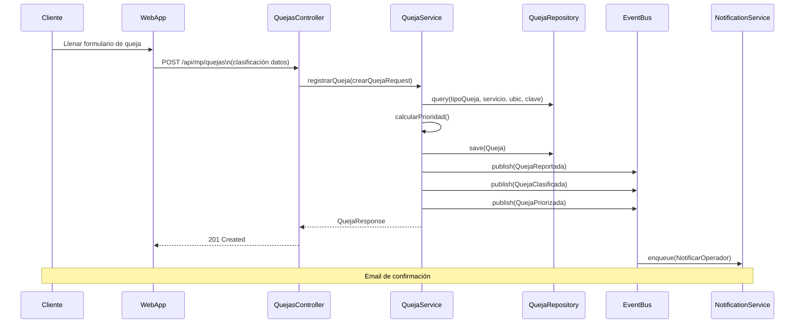
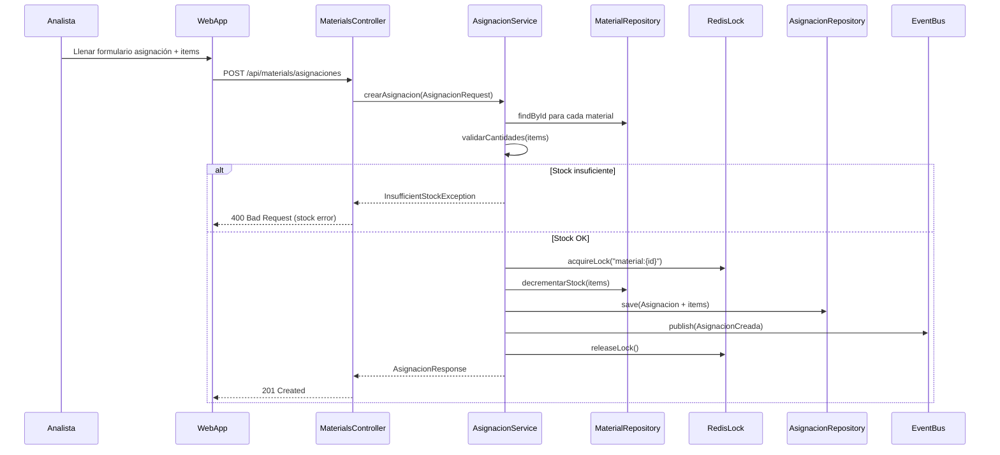
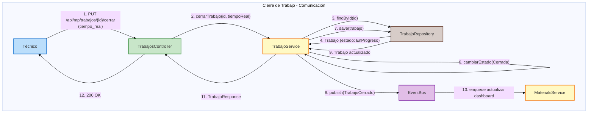
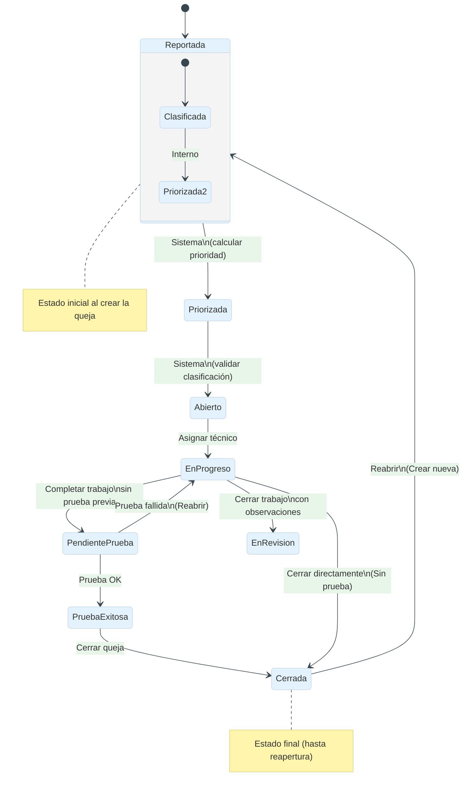
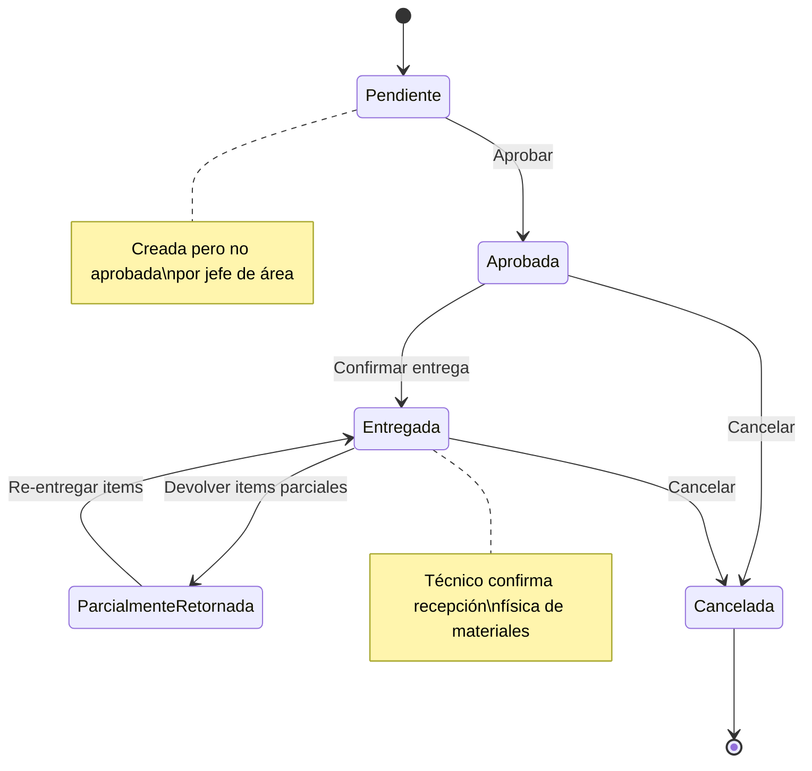
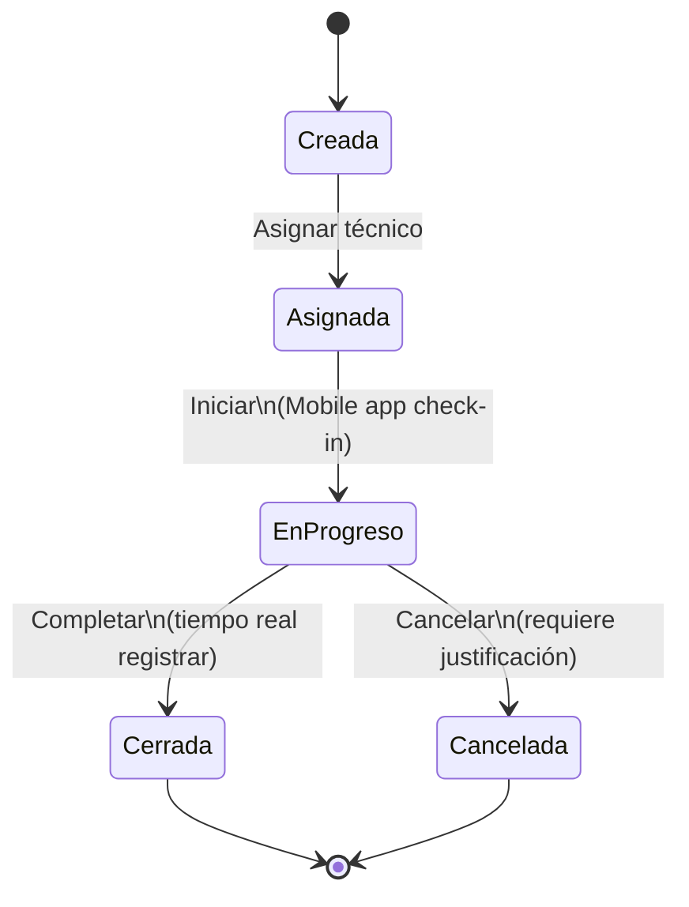
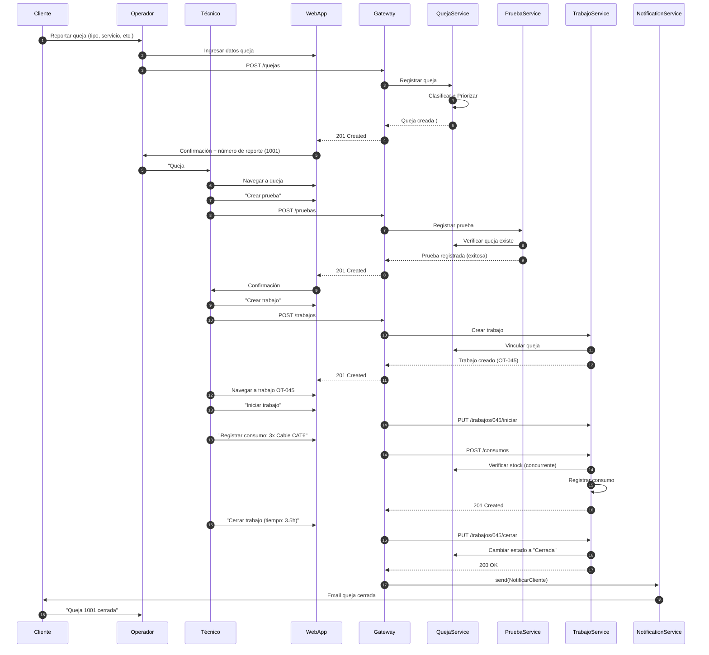

# Práctica 06 - UML Dinámico (Secuencia, Comunicación, State Machine)

> **Disciplina:** Ingeniería de Software  
> **Especialidad:** UML - Vista Dinámica  
> **Basado en:** [SISGAD5_doc/docs/03-08](https://github.com/ybotet/SISGAD5_doc)

---

## 1. Diagramas de Secuencia

### 1.1. Registro de Queja



### 1.2. Login con JWT

```mermaid
sequenceDiagram
    participant U as User
    participant C as WebApp
    participant API as AuthController
    participant S as AuthService
    participant DB as UserRepository
    participant R as RedisBlacklist
    participant E as EventBus

    U->>C: Ingresar email/password
    C->>API: POST /auth/login
    API->>S: authenticate(email, password)
    S->>DB: findByEmail(email)
    DB-->>S: User con passwordHash
    S->>S: verifyPassword(password, hash)
    alt Credenciales inválidas
        S->>S: incrementarIntentos()
        S-->>API: UnauthorizedException
        API-->>C: 401 Unauthorized
        C-->>U: Mostrar error
    else Credenciales válidas
        S->>R: estaBloqueado(email)
        alt Bloqueado
            S-->>API: AccountLockedException
            API-->>C: 423 Locked
        else No bloqueado
            S->>S: resetearIntentos()
            S->>S: generarAccessToken(user)
            S->>S: generarRefreshToken(user)
            S->>DB: save(Sesion)
            S-->>API: AuthResponse(tokens)
            API-->>C: 200 OK + cookies
            C-->>U: Redirect a Dashboard
    end
```

### 1.3. Crear Asignación de Materiales



---

## 2. Diagramas de Comunicación

### 2.1. Cierre de Trabajo



---

## 3. Máquinas de Estado

### 3.1. Estado de Queja



### 3.2. Estado de Asignación



### 3.3. Estado de Trabajo



---

## 4. Diagramas de Actividad

### 4.1. Flujo de Asignación → Consumo (Materiales)

```mermaid
activityDiagram-v2
    start
    :Solicitar asignación;
    if (¿Stock disponible?) then (Sí)
        :Crear asignación\n(con items y precios);
        :Bloquear stock lógico;
        :Emitir evento AsignacionCreada;
        if (¿Trabajador confirma entrega?) then (Sí)
            :Cambiar estado a "Entregada";
            :Registrar consumo parcial\n(con precios reales);
            :Validar consumo ≤ asignación;
            :Emitir evento ConsumoCreado;
            :Calcular saldo lógico;
            if (¿Saldo < stock mínimo?) then (Sí)
                :Emitir alerta StockBajoAlertado;
            else (No)
                :Continuar;
            endif
        else (No)
            :Mantener estado "Aprobada";
        endif
    else (No)
        :Error: InsufficientStockException;
        :Devolver detalle faltante;
    endif
    stop
```

### 4.2. Flujo de Queja (FSM - State Machine)

```mermaid
activityDiagram-v2
    start
    :Cliente/operador reporta queja;
    :Sistema clasifica (tipo, servicio, ubicación, clave);
    :Sistema calcula prioridad (1-4);
    if (¿Prioridad = 1?) then (Urgente)
        :Notificar inmediatamente;
        :Asignar a primer técnico disponible;
    else (Normal)
        :Agregar al backlog;
        :Asignar en orden de prioridad;
    endif
    :Técnico ejecuta prueba (si aplica);
    if (¿Prueba exitosa?) then (Sí)
        :Crear orden de trabajo;
        :Asignar técnico;
        :Ejecutar trabajo;
        :Registrar consumo;
        :Cerrar trabajo;
        :Cerrar queja;
        :Enviar notificación al cliente;
    else (No)
        :Reabrir queja;
        :Asignar nuevo técnico;
    endif
    stop
```

---

## 5. Mapa de Secuencia (Diagrama de Interacción)

### Escenario: Queja → Prueba → Trabajo → Cierre (4 fases)



---

## 6. Referencias

- [Diagramas UML](../10_uml_diagrams.md)
- [Event Storming](practice_03_event_storming.md)
- [Máquinas de Estado](../09_state_machines.md)
- [Diagramas de Secuencia](../doc/diagrams/sequence_diagrams/)
- [Flujo de Trabajo](../05_workflow.md)