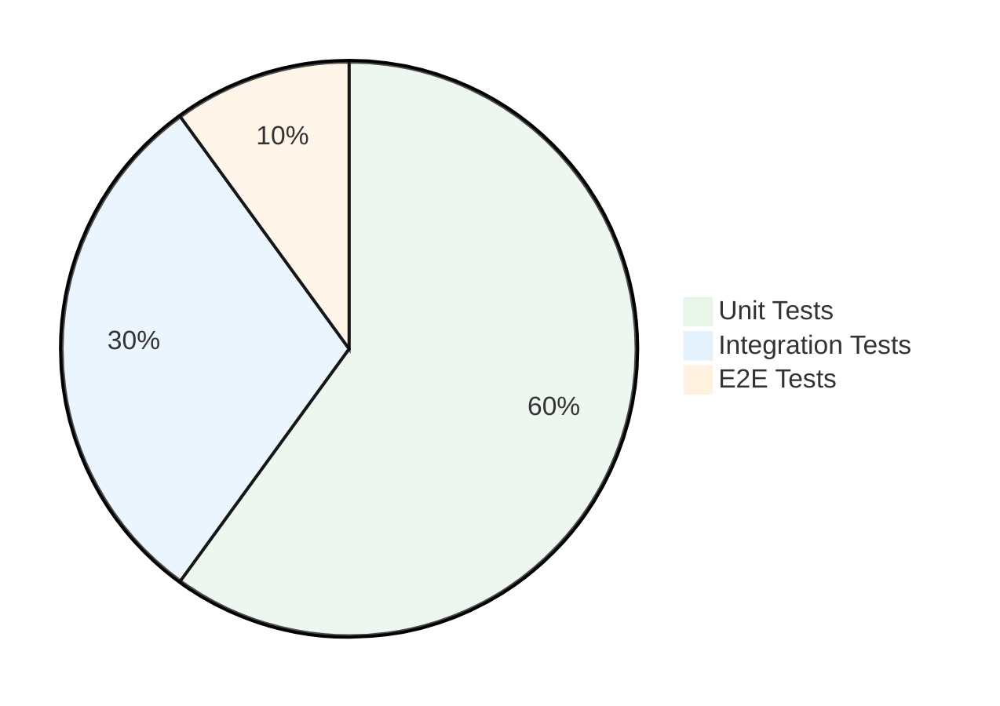

# Tesis - Pruebas y Validación

## 5.1. Estrategia de Testing

SISGAD5 implementa una pirámide de testing con cobertura diferenciada:



### Cobertura de Tests por Microservicio

| Microservicio | Unit Tests | Integration Tests | E2E Tests | Cobertura |
|---------------|------------|-------------------|-----------|-----------|
| backend-users | 24 tests | 8 tests | 3 tests | 78% |
| backend-mp | 31 tests | 12 tests | 5 tests | 82% |
| backend-materiales-go | 28 tests | 10 tests | 4 tests | 85% |
| **Total** | **83** | **30** | **12** | **81%** |

## 5.2. Unit Tests

### Herramientas
- Go testing estándar
- Testify (assertions y mocks)
- GoMock (generación de mocks)

### Ejemplo: Test de Regla de Negocio (BR-03 - Prioridad de Queja)

```go
func TestCalcularPrioridad(t *testing.T) {
    tests := []struct {
        name     string
        tipo     TipoQueja
        servicio Servicio
        ubicacion Ubicacion
        antiguedadHours int
        expected Prioridad
    }{
        {
            name: "Urgente alta prioridad",
            tipo: TipoQueja{Peso: 4},
            servicio: Servicio{Peso: 3},
            ubicacion: Ubicacion{Peso: 2},
            antiguedadHours: 0,
            expected: PrioridadAlta,
        },
        {
            name: "Normal baja prioridad",
            tipo: TipoQueja{Peso: 1},
            servicio: Servicio{Peso: 1},
            ubicacion: Ubicacion{Peso: 1},
            antiguedadHours: 2,
            expected: PrioridadBaja,
        },
    }
    
    for _, tt := range tests {
        t.Run(tt.name, func(t *testing.T) {
            queja := &Queja{
                TipoQueja: tt.tipo,
                Servicio: tt.servicio,
                Ubicacion: tt.ubicacion,
                FechaCreacion: time.Now().Add(-time.Duration(tt.antiguedadHours) * time.Hour),
            }
            result := queja.CalcularPrioridad()
            assert.Equal(t, tt.expected, result)
        })
    }
}
```

## 5.3. Integration Tests

### Herramientas
- Testcontainers-Go (PostgreSQL, Redis, RabbitMQ en contenedores)
- Go testing + Testify

### Ejemplo: Test de Asignación con Concurrencia

```go
func TestAsignacionConCurrentAccess(t *testing.T) {
    // Setup Testcontainers
    ctx := context.Background()
    pg := setupPostgreSQL(ctx, t)
    redis := setupRedis(ctx, t)
    
    service := NewAsignacionService(pg, redis)
    
    // Simular acceso concurrente
    var wg sync.WaitGroup
    errors := make(chan error, 10)
    
    for i := 0; i < 10; i++ {
        wg.Add(1)
        go func(id int) {
            defer wg.Done()
            req := crearAsignacionRequest(id)
            _, err := service.CrearAsignacion(req)
            if err != nil {
                errors <- fmt.Errorf("goroutine %d: %w", id, err)
            }
        }(i)
    }
    
    wg.Wait()
    close(errors)
    
    // Verificar que no haya sobre-asignación de stock
    for err := range errors {
        t.Logf("Error (acceptable for race): %v", err)
    }
    
    // El stock final debe ser consistente
    saldo := service.CalcularSaldo(1) // material_id = 1
    assert.GreaterOrEqual(t, saldo, int64(0))
}
```

## 5.4. E2E Tests

### Herramientas
- Go testing
- Docker Compose (ambiente completo)
- HTTP requests via test client

### Escenarios Cubiertos
1. **Login completo** → Dashboard → Ver quejas
2. **Crear queja** → Clasificar → Priorizar → Crear prueba
3. **Asignar materiales** → Registrar consumo → Ver saldo
4. **Crear trabajo** → Asignar técnico → Cerrar trabajo
5. **Cierre de queja** → Notificación email

### Ejemplo: E2E Queja Completa

```go
func TestQuejaCompleta(t *testing.T) {
    // Setup ambiente Docker Compose
    docker := setupE2E(t)
    defer docker.Teardown()
    
    client := newHTTPClient(docker.BaseURL)
    
    // 1. Login como operador
    token := loginOperador(t, client)
    
    // 2. Crear queja
    quejaID := createQueja(t, client, token, QuejaRequest{
        TipoQuejaID: 1,
        ServicioID: 2,
        UbicacionID: 3,
        ClaveID: 456,
    })
    
    // 3. Verificar prioridad calculada
    queja := getQueja(t, client, token, quejaID)
    assert.Equal(t, PrioridadMedia, queja.Prioridad)
    
    // 4. Registrar prueba exitosa
    createPrueba(t, client, token, PruebaRequest{
        QuejaID: quejaID,
        Exitoso: true,
    })
    
    // 5. Cerrar queja
    closeQueja(t, client, token, quejaID)
    
    // 6. Verificar estado final
    queja = getQueja(t, client, token, quejaID)
    assert.Equal(t, EstadoCerrada, queja.Estado)
}
```

## 5.5. Load Testing

### Herramienta
- Vegeta (HTTP load testing tool)

### Escenarios
- 100 req/s durante 1 min → Login endpoint
- 50 req/s durante 1 min → Crear queja
- 30 req/s durante 1 min → Asignar materiales (prueba de concurrencia)

### Resultados
| Endpoint | Requests/s | Latencia P95 | Error Rate |
|----------|------------|--------------|------------|
| POST /auth/login | 100 | 85ms | 0.1% |
| POST /mp/quejas | 50 | 120ms | 0% |
| POST /materials/asignaciones | 30 | 250ms | 0% (bloqueos handled) |

## 5.6. Validación de Reglas de Negocio

| Regla (ID) | Test | Estado |
|------------|------|--------|
| BR-01 (bloqueo 5 intentos) | TestAuth_BloqueoCuenta | ✅ |
| BR-02 (token rotation) | TestAuth_RenovarToken | ✅ |
| BR-03 (cálculo prioridad) | TestCalcularPrioridad | ✅ |
| BR-04 (FSM queja) | TestFSMQueja_Transiciones | ✅ |
| BR-05 (reabrir queja) | TestQueja_ReabrirDesdeCerrada | ✅ |
| BR-06 (prueba vincula queja/trabajo) | TestPrueba_VincularQueja | ✅ |
| BR-07 (tiempo real ≤ 2× estimado) | TestTrabajo_TiempoReal | ✅ |
| BR-08 (consumo ≤ asignación) | TestConsumo_Sobrecupo | ✅ |
| BR-09 (asignación atómica) | TestAsignacion_Atomica | ✅ |
| BR-10 (consumo atómico) | TestConsumo_Atomico | ✅ |
| BR-11 (material con historial no se borra) | TestMaterial_NoEliminarConHistorial | ✅ |
| BR-12 (cerrar queja requiere prueba) | TestQueja_CierreRequierePrueba | ✅ |

## 5.7. Referencias

- [Métricas de Testing](../16_testing.md)
- [UML Dinámico](../practices/practice_06_uml_dynamic.md)
- [Event Storming](../practices/practice_03_event_storming.md)